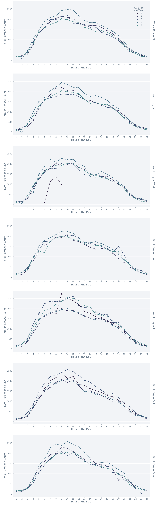

<h1>Table of Contents<span class="tocSkip"></span></h1>
<div class="toc"><ul class="toc-item"><li><span><a href="#SPARK-REVIEW-INFO" data-toc-modified-id="SPARK-REVIEW-INFO-1"><span class="toc-item-num">1&nbsp;&nbsp;</span>SPARK REVIEW INFO</a></span></li><li><span><a href="#DEPENDENCIES-&amp;-INITIATE-SPARK" data-toc-modified-id="DEPENDENCIES-&amp;-INITIATE-SPARK-2"><span class="toc-item-num">2&nbsp;&nbsp;</span>DEPENDENCIES &amp; INITIATE SPARK</a></span></li><li><span><a href="#INITIATE-ANALYSIS" data-toc-modified-id="INITIATE-ANALYSIS-3"><span class="toc-item-num">3&nbsp;&nbsp;</span>INITIATE ANALYSIS</a></span><ul class="toc-item"><li><span><a href="#IMPORT-FILE" data-toc-modified-id="IMPORT-FILE-3.1"><span class="toc-item-num">3.1&nbsp;&nbsp;</span>IMPORT FILE</a></span></li><li><span><a href="#TABLE-REVIEW" data-toc-modified-id="TABLE-REVIEW-3.2"><span class="toc-item-num">3.2&nbsp;&nbsp;</span>TABLE REVIEW</a></span><ul class="toc-item"><li><span><a href="#COUNTING-RECORDS-AND-COLUMNS" data-toc-modified-id="COUNTING-RECORDS-AND-COLUMNS-3.2.1"><span class="toc-item-num">3.2.1&nbsp;&nbsp;</span>COUNTING RECORDS AND COLUMNS</a></span></li><li><span><a href="#COUNTING-NULL-AND-NA-VALUES" data-toc-modified-id="COUNTING-NULL-AND-NA-VALUES-3.2.2"><span class="toc-item-num">3.2.2&nbsp;&nbsp;</span>COUNTING NULL AND NA VALUES</a></span></li></ul></li><li><span><a href="#DATA-MANIPULATIONS" data-toc-modified-id="DATA-MANIPULATIONS-3.3"><span class="toc-item-num">3.3&nbsp;&nbsp;</span>DATA MANIPULATIONS</a></span><ul class="toc-item"><li><span><a href="#TIME-AND-CATEGORY" data-toc-modified-id="TIME-AND-CATEGORY-3.3.1"><span class="toc-item-num">3.3.1&nbsp;&nbsp;</span>TIME AND CATEGORY</a></span></li></ul></li><li><span><a href="#SET-SQL-TABLE-VIEWS" data-toc-modified-id="SET-SQL-TABLE-VIEWS-3.4"><span class="toc-item-num">3.4&nbsp;&nbsp;</span>SET SQL TABLE VIEWS</a></span></li><li><span><a href="#EDA-SECTION-I" data-toc-modified-id="EDA-SECTION-I-3.5"><span class="toc-item-num">3.5&nbsp;&nbsp;</span>EDA SECTION I</a></span><ul class="toc-item"><li><span><a href="#REVIEWING-PRIMARY-CATEGORIES-AND-PRICING" data-toc-modified-id="REVIEWING-PRIMARY-CATEGORIES-AND-PRICING-3.5.1"><span class="toc-item-num">3.5.1&nbsp;&nbsp;</span>REVIEWING PRIMARY CATEGORIES AND PRICING</a></span></li><li><span><a href="#REVIEWING-BRANDS-AND-PRICING" data-toc-modified-id="REVIEWING-BRANDS-AND-PRICING-3.5.2"><span class="toc-item-num">3.5.2&nbsp;&nbsp;</span>REVIEWING BRANDS AND PRICING</a></span></li><li><span><a href="#REVIEWING-POPULARITY-BY-BRAND,-CATEGORY,-USERS" data-toc-modified-id="REVIEWING-POPULARITY-BY-BRAND,-CATEGORY,-USERS-3.5.3"><span class="toc-item-num">3.5.3&nbsp;&nbsp;</span>REVIEWING POPULARITY BY BRAND, CATEGORY, USERS</a></span></li><li><span><a href="#REVIEWING-EVENT-TYPE" data-toc-modified-id="REVIEWING-EVENT-TYPE-3.5.4"><span class="toc-item-num">3.5.4&nbsp;&nbsp;</span>REVIEWING EVENT TYPE</a></span><ul class="toc-item"><li><span><a href="#EVENT-TYPE-AND-PRICE" data-toc-modified-id="EVENT-TYPE-AND-PRICE-3.5.4.1"><span class="toc-item-num">3.5.4.1&nbsp;&nbsp;</span>EVENT TYPE AND PRICE</a></span></li><li><span><a href="#EVENT-TYPE-AND-CATEGORY" data-toc-modified-id="EVENT-TYPE-AND-CATEGORY-3.5.4.2"><span class="toc-item-num">3.5.4.2&nbsp;&nbsp;</span>EVENT TYPE AND CATEGORY</a></span></li></ul></li><li><span><a href="#REVIEW-PRICING-BY-PLOTTING" data-toc-modified-id="REVIEW-PRICING-BY-PLOTTING-3.5.5"><span class="toc-item-num">3.5.5&nbsp;&nbsp;</span>REVIEW PRICING BY PLOTTING</a></span></li></ul></li><li><span><a href="#SPECIFIC-ANALYSIS" data-toc-modified-id="SPECIFIC-ANALYSIS-3.6"><span class="toc-item-num">3.6&nbsp;&nbsp;</span>SPECIFIC ANALYSIS</a></span><ul class="toc-item"><li><span><a href="#REVENUE-REVIEW-OF-CATEGORICAL-DATA" data-toc-modified-id="REVENUE-REVIEW-OF-CATEGORICAL-DATA-3.6.1"><span class="toc-item-num">3.6.1&nbsp;&nbsp;</span>REVENUE REVIEW OF CATEGORICAL DATA</a></span></li><li><span><a href="#EVALUATING-TIME-SERIES-OF-PURCHASES" data-toc-modified-id="EVALUATING-TIME-SERIES-OF-PURCHASES-3.6.2"><span class="toc-item-num">3.6.2&nbsp;&nbsp;</span>EVALUATING TIME SERIES OF PURCHASES</a></span><ul class="toc-item"><li><span><a href="#PER-HOUR-FOR-DAYS-IN-THE-MONTH" data-toc-modified-id="PER-HOUR-FOR-DAYS-IN-THE-MONTH-3.6.2.1"><span class="toc-item-num">3.6.2.1&nbsp;&nbsp;</span>PER HOUR FOR DAYS IN THE MONTH</a></span></li><li><span><a href="#PER-DAY-FOR-ALL-DAYS-IN-THE-MONTH" data-toc-modified-id="PER-DAY-FOR-ALL-DAYS-IN-THE-MONTH-3.6.2.2"><span class="toc-item-num">3.6.2.2&nbsp;&nbsp;</span>PER DAY FOR ALL DAYS IN THE MONTH</a></span></li><li><span><a href="#PER-WEEK-FOR-ALL-WEEKS-IN-THE-MONTH" data-toc-modified-id="PER-WEEK-FOR-ALL-WEEKS-IN-THE-MONTH-3.6.2.3"><span class="toc-item-num">3.6.2.3&nbsp;&nbsp;</span>PER WEEK FOR ALL WEEKS IN THE MONTH</a></span></li><li><span><a href="#PLOTTING-PURCHASE-COUNTS-BY-HOUR-AND-WEEK-FOR-THE-MONTH" data-toc-modified-id="PLOTTING-PURCHASE-COUNTS-BY-HOUR-AND-WEEK-FOR-THE-MONTH-3.6.2.4"><span class="toc-item-num">3.6.2.4&nbsp;&nbsp;</span>PLOTTING PURCHASE COUNTS BY HOUR AND WEEK FOR THE MONTH</a></span></li></ul></li></ul></li><li><span><a href="#MACHINE-LEARNING" data-toc-modified-id="MACHINE-LEARNING-3.7"><span class="toc-item-num">3.7&nbsp;&nbsp;</span>MACHINE LEARNING</a></span><ul class="toc-item"><li><span><a href="#FEATURE-INPUT" data-toc-modified-id="FEATURE-INPUT-3.7.1"><span class="toc-item-num">3.7.1&nbsp;&nbsp;</span>FEATURE INPUT</a></span><ul class="toc-item"><li><span><a href="#SCALE-DATA" data-toc-modified-id="SCALE-DATA-3.7.1.1"><span class="toc-item-num">3.7.1.1&nbsp;&nbsp;</span>SCALE DATA</a></span></li></ul></li><li><span><a href="#LOGISTIC-REGRESSION" data-toc-modified-id="LOGISTIC-REGRESSION-3.7.2"><span class="toc-item-num">3.7.2&nbsp;&nbsp;</span>LOGISTIC REGRESSION</a></span></li><li><span><a href="#RANDOM-FOREST" data-toc-modified-id="RANDOM-FOREST-3.7.3"><span class="toc-item-num">3.7.3&nbsp;&nbsp;</span>RANDOM FOREST</a></span></li></ul></li></ul></li><li><span><a href="#-NOT-USED-" data-toc-modified-id="-NOT-USED--4"><span class="toc-item-num">4&nbsp;&nbsp;</span>-NOT USED-</a></span></li></ul></div>

 

 

# -BIG DATA PROJECT - ECOMMERCE-

## SPARK REVIEW INFO

Data Source: 
https://www.kaggle.com/mkechinov/ecommerce-behavior-data-from-multi-category-store#2019-Nov.csv

Visualization Links:
- Edit Visuals in the gridspace
https://matplotlib.org/3.1.1/api/_as_gen/matplotlib.gridspec.GridSpec.html


```python
from IPython.core.display import display, HTML
display(HTML("<style>.container { width:95% !important; }</style>"))
```

<br><br>

<br><br>

<br><br>

<br><br>

 

## DEPENDENCIES & INITIATE SPARK


```python
# IMPORT LIBS SET 1

# Main python libs
import pandas as pd
import numpy as np
from IPython.display import display

```


```python
# IMPORT VISUALIZATION LIBS
import matplotlib.ticker as mtick
import matplotlib.pyplot as plt
from matplotlib import rcParams
import matplotlib as mpl
%matplotlib inline
import seaborn as sns

# setting the color set
colorset10 = sns.cubehelix_palette(10,
                                   start=0.5,
                                   rot=-.75,
                                   dark=0.15,
                                   light=.85,
                                   reverse=True)

colorset25 = sns.cubehelix_palette(25,
                                   start=0.5,
                                   rot=-.75,
                                   dark=0.15,
                                   light=.85,
                                   reverse=True)

# color map
colormap = sns.cubehelix_palette(8,
                                 start=0.5,
                                 rot=-.75,
                                 dark=0.15,
                                 light=.85,
                                 reverse=True,
                                 as_cmap=True)

# setting the palette
palette1 = sns.color_palette(colorset10)
print(sns.palplot(palette1))

# Setting notebook parameters
rcVizParams = {
    # setting label sizes
    'legend.fontsize': 12,
    'figure.figsize': (12, 6),
    'axes.labelsize': 15,
    'axes.titlesize': 18,
    'figure.titleweight': 'bold',
    'xtick.labelsize': 12,
    'ytick.labelsize': 12,
    'figure.dpi': 120,
    # setting colors
    'text.color': 'slategrey',
    'axes.labelcolor': 'slategrey',
    'xtick.color': 'slategrey',
    'ytick.color': 'slategrey',
    #'font.family': ['Helvetica'],
    "lines.linewidth": 1
}
# sns.set(#font_scale=1.4,
#         rc=rcVizParams)
mpl.rcParams.update(rcVizParams)
mpl.rc(
    'axes',
    facecolor='#f2f4f7',
    #facecolor='#f2f6fc',
    edgecolor='none',
    axisbelow=True,
    grid=True)
mpl.rc('grid', color='w', linestyle='solid')

# context options
## 'paper' - 'notebook' - 'talk' - 'poster'
#sns.set_style('darkgrid')
# sns.set_context('notebook')
print(plt.style.available)
plt.style.use(u'fast')  # ggplot -  seaborn
# sns.set(#font_scale=1.4,
#         rc=rcVizParams)
```

    None
    ['bmh', 'classic', 'dark_background', 'fast', 'fivethirtyeight', 'ggplot', 'grayscale', 'seaborn-bright', 'seaborn-colorblind', 'seaborn-dark-palette', 'seaborn-dark', 'seaborn-darkgrid', 'seaborn-deep', 'seaborn-muted', 'seaborn-notebook', 'seaborn-paper', 'seaborn-pastel', 'seaborn-poster', 'seaborn-talk', 'seaborn-ticks', 'seaborn-white', 'seaborn-whitegrid', 'seaborn', 'Solarize_Light2', 'tableau-colorblind10', '_classic_test']
    


```python
# Review RcParam Options
# print(mpl.pyplot.rcParams)

# Reset Theme Back
#mpl.rcParams.update(mpl.rcParamsDefault)
```


```python
###Import the required classes
from pyspark.conf import SparkConf
from pyspark.sql import SparkSession
#--
###Get the default configurations
spark.sparkContext._conf.getAll()
#--
###Update the default configurations
conf = spark.sparkContext._conf.setAll([('spark.executor.memory', '16g'), 
                                        ('spark.app.name', 'Spark Updated Conf'), 
                                        ('spark.executor.cores', '4'), 
                                        ('spark.cores.max', '4'), 
                                        ('spark.driver.memory','16g')])
###Stop the current Spark Session
#spark.sparkContext.stop()
#--
###Create a Spark Session
spark = SparkSession.builder.config(conf=conf).getOrCreate()
```


```python
# Main pyspark libs
import pyspark       # Add 05-05
from pyspark.sql      import SparkSession   # new entry point - Main Session 
from pyspark.sql      import SQLContext     # 
from pyspark          import SparkConf      # Set and edit confuraction settings
# Spark Speciffic Libs
from pyspark.sql.functions import isnan, when, count, col
from pyspark.sql.functions import mean, max, min
import pyspark.sql.functions as func
```


```python
###To change the default spark configurations you can follow these steps:
###Import the required classes
# Note: Imported Above
#--
###Get the default configurations
spark = SparkSession.builder.getOrCreate()
sqlContext = SQLContext(spark)                               # Typically would be sqlContext=SQLContext(sc)

#-- 
print(spark.sql("select 'spark' as hello ").show())
```

    +-----+
    |hello|
    +-----+
    |spark|
    +-----+
    
    None
    


```python
# LOADING THE PYSPARK SESSION 
#- - - - - - - - - - - - - - - - - - - - - - - - - - - - - - - - - - - -
# source: https://stackoverflow.com/questions/41886346/spark-2-1-0-session-config-settings-pyspark
# source: https://www.kaggle.com/fatmakursun/pyspark-ml-tutorial-for-beginners
# source: new v old: https://gankrin.org/sparksession-vs-sparkcontext-vs-sqlcontext-vs-hivecontext/

# Main pyspark libs
import pyspark       # Add 05-05
from pyspark.sql      import SparkSession   # new entry point - Main Session 
#from pyspark.context  import SparkContext  # old entry point to apache spark functionality
from pyspark.sql      import SQLContext     # 
from pyspark          import SparkConf      # Set and edit confuraction settings


#from pyspark import RDD, since, keyword_only
###To change the default spark configurations you can follow these steps:
###Import the required classes
# Note: Imported Above
#--
###Get the default configurations
spark = SparkSession.builder.getOrCreate()
#spark.sparkContext._conf.getAll()
#--
###Update the default configurations
conf = spark.sparkContext._conf.setAll([
    #('spark.executor.memory', '24g'),  # ~90% of 32GB
    ('spark.app.name', 'Spark Updated Conf'),
    ('spark.executor.cores', '4'),
    ('spark.cores.max', '4'),
    #('spark.driver.memory', '24g')
])
###Stop the current Spark Session
#spark.sparkContext.stop()
#--
###Create a Spark Session
#sc         = spark.sparkContext.getOrCreate() # old way of doing it 
                             # Typically would be sc=Sparkcontext()
spark      = SparkSession.builder.config(conf=conf).getOrCreate()
sqlContext = SQLContext(spark)                               # Typically would be sqlContext=SQLContext(sc)

#-- 
print(spark.sql("select 'spark' as hello ").show())
#- - - - - - - - - - - - - - - - - - - - - - - - - - - - - - - - - - - -
```


```python
# Review spark settings
display(#'SC', sc, sc.sparkContext._conf.getAll(), 
        'spark', "spark", spark.sparkContext._conf.getAll(), 
        'sqlcontext', sqlContext)
```


    'spark'


    'spark'


    [('spark.driver.host', '172.31.29.10'),
     ('spark.rdd.compress', 'True'),
     ('spark.app.id', 'local-1590371855740'),
     ('spark.serializer.objectStreamReset', '100'),
     ('spark.master', 'local[*]'),
     ('spark.driver.port', '50698'),
     ('spark.executor.id', 'driver'),
     ('spark.submit.deployMode', 'client'),
     ('spark.ui.showConsoleProgress', 'true'),
     ('spark.app.name', 'pyspark-shell')]


    'sqlcontext'


    <pyspark.sql.context.SQLContext at 0x1cf08983108>


## INITIATE ANALYSIS

### IMPORT FILE 


```python
# OCT
# Large File - Import large main File - average time to load file = 3:30 min:sec
df_oct = spark.read.csv(path="2019-Oct.csv", inferSchema=True, header=True, nullValue='NA')
df_oct.show(5)
```

    +--------------------+----------+----------+-------------------+--------------------+--------+-------+---------+--------------------+
    |          event_time|event_type|product_id|        category_id|       category_code|   brand|  price|  user_id|        user_session|
    +--------------------+----------+----------+-------------------+--------------------+--------+-------+---------+--------------------+
    |2019-10-01 00:00:...|      view|  44600062|2103807459595387724|                null|shiseido|  35.79|541312140|72d76fde-8bb3-4e0...|
    |2019-10-01 00:00:...|      view|   3900821|2053013552326770905|appliances.enviro...|    aqua|   33.2|554748717|9333dfbd-b87a-470...|
    |2019-10-01 00:00:...|      view|  17200506|2053013559792632471|furniture.living_...|    null|  543.1|519107250|566511c2-e2e3-422...|
    |2019-10-01 00:00:...|      view|   1307067|2053013558920217191|  computers.notebook|  lenovo| 251.74|550050854|7c90fc70-0e80-459...|
    |2019-10-01 00:00:...|      view|   1004237|2053013555631882655|electronics.smart...|   apple|1081.98|535871217|c6bd7419-2748-4c5...|
    +--------------------+----------+----------+-------------------+--------------------+--------+-------+---------+--------------------+
    only showing top 5 rows
    
    


```python
# NOV
# Large File - Import large main File - average time to load file = 3:30 min:sec
df_nov = spark.read.csv(path="2019-Nov.csv", inferSchema=True, header=True, nullValue='NA')
df_nov.show(5)
```

    +--------------------+----------+----------+-------------------+--------------------+------+------+---------+--------------------+
    |          event_time|event_type|product_id|        category_id|       category_code| brand| price|  user_id|        user_session|
    +--------------------+----------+----------+-------------------+--------------------+------+------+---------+--------------------+
    |2019-11-01 00:00:...|      view|   1003461|2053013555631882655|electronics.smart...|xiaomi|489.07|520088904|4d3b30da-a5e4-49d...|
    |2019-11-01 00:00:...|      view|   5000088|2053013566100866035|appliances.sewing...|janome|293.65|530496790|8e5f4f83-366c-4f7...|
    |2019-11-01 00:00:...|      view|  17302664|2053013553853497655|                null| creed| 28.31|561587266|755422e7-9040-477...|
    |2019-11-01 00:00:...|      view|   3601530|2053013563810775923|appliances.kitche...|    lg|712.87|518085591|3bfb58cd-7892-48c...|
    |2019-11-01 00:00:...|      view|   1004775|2053013555631882655|electronics.smart...|xiaomi|183.27|558856683|313628f1-68b8-460...|
    +--------------------+----------+----------+-------------------+--------------------+------+------+---------+--------------------+
    only showing top 5 rows
    
    


```python
# DEC
# Large File - Import large main File - average time to load file = 3:30 min:sec
df_dec = spark.read.csv(path="2019-Dec.csv.gz", inferSchema=True, header=True, nullValue='NA')
df_dec.show(5)
```

    +--------------------+----------+----------+-------------------+--------------------+-----+-------+---------+--------------------+
    |          event_time|event_type|product_id|        category_id|       category_code|brand|  price|  user_id|        user_session|
    +--------------------+----------+----------+-------------------+--------------------+-----+-------+---------+--------------------+
    |2019-12-01 00:00:...|      view|   1005105|2232732093077520756|construction.tool...|apple|1302.48|556695836|ca5eefc5-11f9-450...|
    |2019-12-01 00:00:...|      view|  22700068|2232732091643068746|                null|force| 102.96|577702456|de33debe-c7bf-44e...|
    |2019-12-01 00:00:...|      view|   2402273|2232732100769874463|appliances.person...|bosch| 313.52|539453785|5ee185a7-0689-4a3...|
    |2019-12-01 00:00:...|  purchase|  26400248|2053013553056579841|computers.periphe...| null| 132.31|535135317|61792a26-672f-4e6...|
    |2019-12-01 00:00:...|      view|  20100164|2232732110089618156|    apparel.trousers| nika| 101.68|517987650|906c6ca8-ff5c-419...|
    +--------------------+----------+----------+-------------------+--------------------+-----+-------+---------+--------------------+
    only showing top 5 rows
    
    


```python
# JAN
# Large File - Import large main File - average time to load file = 3:30 min:sec
df_jan = spark.read.csv(path="2020-Jan.csv.gz", inferSchema=True, header=True, nullValue='NA')
df_jan.show(5)
```

    +--------------------+----------+----------+-------------------+--------------------+-------+-------+---------+--------------------+
    |          event_time|event_type|product_id|        category_id|       category_code|  brand|  price|  user_id|        user_session|
    +--------------------+----------+----------+-------------------+--------------------+-------+-------+---------+--------------------+
    |2020-01-01 00:00:...|      view|   1005073|2232732093077520756|construction.tool...|samsung|1130.02|519698804|69b5d72f-fd6e-4fe...|
    |2020-01-01 00:00:...|      view|   1005192|2232732093077520756|construction.tool...|  meizu| 205.67|527767423|7f596032-ccbf-464...|
    |2020-01-01 00:00:...|      view| 100063693|2053013552427434207|       apparel.shirt| turtle| 136.43|519046195|d1e2f343-84bb-49b...|
    |2020-01-01 00:00:...|      view|   5100816|2232732103831716449|       apparel.shoes| xiaomi|  29.95|518269232|0444841c-38ef-410...|
    |2020-01-01 00:00:...|      view| 100014325|2232732103294845523|apparel.shoes.ste...|  intel|  167.2|587748686|31b7d4cf-dfac-489...|
    +--------------------+----------+----------+-------------------+--------------------+-------+-------+---------+--------------------+
    only showing top 5 rows
    
    

### TABLE REVIEW

#### COUNTING RECORDS AND COLUMNS


```python
# ALL - FUNCTION FOR RECORD COUNT AND COLUMN OUTPUT
# Count columns and see the names
def recordCountDfCols(dataframe):
    # this function returns a record count along with a print out
    # of the columns included in the dataframe
    cols = []
    for i in dataframe.columns:
        #print(i)
        cols.append(i)
    cols = pd.DataFrame(cols)
    record_count = dataframe.count()

    print(
        "Total columns are: {}, \nTotal records are: {} \nThe column names are: \n{}"
        .format(len(cols), record_count, cols))
    return(record_count)
```


```python
# OCT
# Count columns and see the names
oct_record_count = recordCountDfCols(df_oct)
```

    Total columns are: 9, 
    Total records are: 42448764 
    The column names are: 
                   0
    0     event_time
    1     event_type
    2     product_id
    3    category_id
    4  category_code
    5          brand
    6          price
    7        user_id
    8   user_session
    


```python
# NOV
# Count columns and see the names
nov_record_count = recordCountDfCols(df_nov)
```

    Total columns are: 9, 
    Total records are: 67501979 
    The column names are: 
                   0
    0     event_time
    1     event_type
    2     product_id
    3    category_id
    4  category_code
    5          brand
    6          price
    7        user_id
    8   user_session
    


```python
# DEC
# Count columns and see the names
dec_record_count = recordCountDfCols(df_dec)
```

    Total columns are: 9, 
    Total records are: 67542878 
    The column names are: 
                   0
    0     event_time
    1     event_type
    2     product_id
    3    category_id
    4  category_code
    5          brand
    6          price
    7        user_id
    8   user_session
    


```python
# JAN
# Count columns and see the names
jan_record_count = recordCountDfCols(df_jan)
```

    Total columns are: 9, 
    Total records are: 55967041 
    The column names are: 
                   0
    0     event_time
    1     event_type
    2     product_id
    3    category_id
    4  category_code
    5          brand
    6          price
    7        user_id
    8   user_session
    

#### COUNTING NULL AND NA VALUES


```python
# ALL - FUNCTION TO COUNT NULLS AND COMPUTE NULL PERCENT
#Find null values in all columns
def nullCountPercent(dataframe, record_Count):
    
    dfnull = dataframe.select(
        [count(when(col(c).isNull(), c)).alias(c) for c in dataframe.columns])

    display(print('- '*5,'NULL VALUE COUNTS', '- '*5, 'NULL VALUE PERCENTS','- '*5),
            dfnull.toPandas(),
            ((dfnull.toPandas()/record_Count)*100).round(2))
```


```python
# OCT
#Find null values in all columns
nullCountPercent(df_oct, oct_record_count)
```

    - - - - -  NULL VALUE COUNTS - - - - -  NULL VALUE PERCENTS - - - - - 
    


    None


<div>
<style scoped>
    .dataframe tbody tr th:only-of-type {
        vertical-align: middle;
    }

    .dataframe tbody tr th {
        vertical-align: top;
    }

    .dataframe thead th {
        text-align: right;
    }
</style>
<table border="1" class="dataframe">
  <thead>
    <tr style="text-align: right;">
      <th></th>
      <th>event_time</th>
      <th>event_type</th>
      <th>product_id</th>
      <th>category_id</th>
      <th>category_code</th>
      <th>brand</th>
      <th>price</th>
      <th>user_id</th>
      <th>user_session</th>
      <th>event_totd</th>
      <th>event_date</th>
      <th>event_hour</th>
      <th>event_minute</th>
      <th>Time1440Mins</th>
      <th>dotw_num</th>
      <th>dotw_day</th>
      <th>dotm_num</th>
      <th>woty_num</th>
      <th>primary_cat</th>
      <th>PurchaseYN</th>
    </tr>
  </thead>
  <tbody>
    <tr>
      <th>0</th>
      <td>0</td>
      <td>0</td>
      <td>0</td>
      <td>0</td>
      <td>13515609</td>
      <td>6113008</td>
      <td>0</td>
      <td>0</td>
      <td>2</td>
      <td>0</td>
      <td>0</td>
      <td>0</td>
      <td>0</td>
      <td>0</td>
      <td>0</td>
      <td>0</td>
      <td>0</td>
      <td>0</td>
      <td>13515609</td>
      <td>0</td>
    </tr>
  </tbody>
</table>
</div>


<div>
<style scoped>
    .dataframe tbody tr th:only-of-type {
        vertical-align: middle;
    }

    .dataframe tbody tr th {
        vertical-align: top;
    }

    .dataframe thead th {
        text-align: right;
    }
</style>
<table border="1" class="dataframe">
  <thead>
    <tr style="text-align: right;">
      <th></th>
      <th>event_time</th>
      <th>event_type</th>
      <th>product_id</th>
      <th>category_id</th>
      <th>category_code</th>
      <th>brand</th>
      <th>price</th>
      <th>user_id</th>
      <th>user_session</th>
      <th>event_totd</th>
      <th>event_date</th>
      <th>event_hour</th>
      <th>event_minute</th>
      <th>Time1440Mins</th>
      <th>dotw_num</th>
      <th>dotw_day</th>
      <th>dotm_num</th>
      <th>woty_num</th>
      <th>primary_cat</th>
      <th>PurchaseYN</th>
    </tr>
  </thead>
  <tbody>
    <tr>
      <th>0</th>
      <td>0.0</td>
      <td>0.0</td>
      <td>0.0</td>
      <td>0.0</td>
      <td>31.84</td>
      <td>14.4</td>
      <td>0.0</td>
      <td>0.0</td>
      <td>0.0</td>
      <td>0.0</td>
      <td>0.0</td>
      <td>0.0</td>
      <td>0.0</td>
      <td>0.0</td>
      <td>0.0</td>
      <td>0.0</td>
      <td>0.0</td>
      <td>0.0</td>
      <td>31.84</td>
      <td>0.0</td>
    </tr>
  </tbody>
</table>
</div>


```python
# NOV
#Find null values in all columns
nullCountPercent(df_nov, nov_record_count)
```

    - - - - -  NULL VALUE COUNTS - - - - -  NULL VALUE PERCENTS - - - - - 
    


    None


<div>
<style scoped>
    .dataframe tbody tr th:only-of-type {
        vertical-align: middle;
    }

    .dataframe tbody tr th {
        vertical-align: top;
    }

    .dataframe thead th {
        text-align: right;
    }
</style>
<table border="1" class="dataframe">
  <thead>
    <tr style="text-align: right;">
      <th></th>
      <th>event_time</th>
      <th>event_type</th>
      <th>product_id</th>
      <th>category_id</th>
      <th>category_code</th>
      <th>brand</th>
      <th>price</th>
      <th>user_id</th>
      <th>user_session</th>
      <th>event_totd</th>
      <th>event_date</th>
      <th>event_hour</th>
      <th>event_minute</th>
      <th>Time1440Mins</th>
      <th>dotw_num</th>
      <th>dotw_day</th>
      <th>dotm_num</th>
      <th>woty_num</th>
      <th>primary_cat</th>
      <th>PurchaseYN</th>
    </tr>
  </thead>
  <tbody>
    <tr>
      <th>0</th>
      <td>0</td>
      <td>0</td>
      <td>0</td>
      <td>0</td>
      <td>21898171</td>
      <td>9218235</td>
      <td>0</td>
      <td>0</td>
      <td>10</td>
      <td>0</td>
      <td>0</td>
      <td>0</td>
      <td>0</td>
      <td>0</td>
      <td>0</td>
      <td>0</td>
      <td>0</td>
      <td>0</td>
      <td>21898171</td>
      <td>0</td>
    </tr>
  </tbody>
</table>
</div>


<div>
<style scoped>
    .dataframe tbody tr th:only-of-type {
        vertical-align: middle;
    }

    .dataframe tbody tr th {
        vertical-align: top;
    }

    .dataframe thead th {
        text-align: right;
    }
</style>
<table border="1" class="dataframe">
  <thead>
    <tr style="text-align: right;">
      <th></th>
      <th>event_time</th>
      <th>event_type</th>
      <th>product_id</th>
      <th>category_id</th>
      <th>category_code</th>
      <th>brand</th>
      <th>price</th>
      <th>user_id</th>
      <th>user_session</th>
      <th>event_totd</th>
      <th>event_date</th>
      <th>event_hour</th>
      <th>event_minute</th>
      <th>Time1440Mins</th>
      <th>dotw_num</th>
      <th>dotw_day</th>
      <th>dotm_num</th>
      <th>woty_num</th>
      <th>primary_cat</th>
      <th>PurchaseYN</th>
    </tr>
  </thead>
  <tbody>
    <tr>
      <th>0</th>
      <td>0.0</td>
      <td>0.0</td>
      <td>0.0</td>
      <td>0.0</td>
      <td>32.44</td>
      <td>13.66</td>
      <td>0.0</td>
      <td>0.0</td>
      <td>0.0</td>
      <td>0.0</td>
      <td>0.0</td>
      <td>0.0</td>
      <td>0.0</td>
      <td>0.0</td>
      <td>0.0</td>
      <td>0.0</td>
      <td>0.0</td>
      <td>0.0</td>
      <td>32.44</td>
      <td>0.0</td>
    </tr>
  </tbody>
</table>
</div>


```python
# DEC
#Find null values in all columns
nullCountPercent(df_dec, dec_record_count)
```

    - - - - -  NULL VALUE COUNTS - - - - -  NULL VALUE PERCENTS - - - - - 
    


    None


<div>
<style scoped>
    .dataframe tbody tr th:only-of-type {
        vertical-align: middle;
    }

    .dataframe tbody tr th {
        vertical-align: top;
    }

    .dataframe thead th {
        text-align: right;
    }
</style>
<table border="1" class="dataframe">
  <thead>
    <tr style="text-align: right;">
      <th></th>
      <th>event_time</th>
      <th>event_type</th>
      <th>product_id</th>
      <th>category_id</th>
      <th>category_code</th>
      <th>brand</th>
      <th>price</th>
      <th>user_id</th>
      <th>user_session</th>
    </tr>
  </thead>
  <tbody>
    <tr>
      <th>0</th>
      <td>0</td>
      <td>0</td>
      <td>0</td>
      <td>0</td>
      <td>7088848</td>
      <td>8115813</td>
      <td>0</td>
      <td>0</td>
      <td>21</td>
    </tr>
  </tbody>
</table>
</div>


<div>
<style scoped>
    .dataframe tbody tr th:only-of-type {
        vertical-align: middle;
    }

    .dataframe tbody tr th {
        vertical-align: top;
    }

    .dataframe thead th {
        text-align: right;
    }
</style>
<table border="1" class="dataframe">
  <thead>
    <tr style="text-align: right;">
      <th></th>
      <th>event_time</th>
      <th>event_type</th>
      <th>product_id</th>
      <th>category_id</th>
      <th>category_code</th>
      <th>brand</th>
      <th>price</th>
      <th>user_id</th>
      <th>user_session</th>
    </tr>
  </thead>
  <tbody>
    <tr>
      <th>0</th>
      <td>0.0</td>
      <td>0.0</td>
      <td>0.0</td>
      <td>0.0</td>
      <td>10.5</td>
      <td>12.02</td>
      <td>0.0</td>
      <td>0.0</td>
      <td>0.0</td>
    </tr>
  </tbody>
</table>
</div>


```python
# JAN
#Find null values in all columns
nullCountPercent(df_jan, jan_record_count)
```

    - - - - -  NULL VALUE COUNTS - - - - -  NULL VALUE PERCENTS - - - - - 
    


    None


<div>
<style scoped>
    .dataframe tbody tr th:only-of-type {
        vertical-align: middle;
    }

    .dataframe tbody tr th {
        vertical-align: top;
    }

    .dataframe thead th {
        text-align: right;
    }
</style>
<table border="1" class="dataframe">
  <thead>
    <tr style="text-align: right;">
      <th></th>
      <th>event_time</th>
      <th>event_type</th>
      <th>product_id</th>
      <th>category_id</th>
      <th>category_code</th>
      <th>brand</th>
      <th>price</th>
      <th>user_id</th>
      <th>user_session</th>
    </tr>
  </thead>
  <tbody>
    <tr>
      <th>0</th>
      <td>0</td>
      <td>0</td>
      <td>0</td>
      <td>0</td>
      <td>5044890</td>
      <td>6532738</td>
      <td>0</td>
      <td>0</td>
      <td>19</td>
    </tr>
  </tbody>
</table>
</div>


<div>
<style scoped>
    .dataframe tbody tr th:only-of-type {
        vertical-align: middle;
    }

    .dataframe tbody tr th {
        vertical-align: top;
    }

    .dataframe thead th {
        text-align: right;
    }
</style>
<table border="1" class="dataframe">
  <thead>
    <tr style="text-align: right;">
      <th></th>
      <th>event_time</th>
      <th>event_type</th>
      <th>product_id</th>
      <th>category_id</th>
      <th>category_code</th>
      <th>brand</th>
      <th>price</th>
      <th>user_id</th>
      <th>user_session</th>
    </tr>
  </thead>
  <tbody>
    <tr>
      <th>0</th>
      <td>0.0</td>
      <td>0.0</td>
      <td>0.0</td>
      <td>0.0</td>
      <td>9.01</td>
      <td>11.67</td>
      <td>0.0</td>
      <td>0.0</td>
      <td>0.0</td>
    </tr>
  </tbody>
</table>
</div>


### DATA MANIPULATIONS

#### TIME AND CATEGORY 


```python
# Transfrom Datse and cols function
# Convert the remaining datetype fields "df_jan" file
# SOURCE: https://www.w3schools.com/sql/func_mysql_date_format.asp
import pyspark.sql.functions as sparkf
from pyspark.sql.functions import col
from pyspark.sql.functions import from_unixtime, date_format, to_date
from pyspark.sql.functions import to_timestamp, unix_timestamp, hour, minute
from pyspark.sql.functions import split

def transformDatesColValues(dataframe):
    # Convert 'event_time' to a data/time timestamp
    dataframe = dataframe.withColumn(
        "event_time",
        to_timestamp(dataframe['event_time'], 'yyyy-MM-dd HH:mm:ss'))

    dataframe = dataframe.withColumn('event_totd', date_format('event_time', 'HH:mm:ss')) \
                    .withColumn('event_date', date_format('event_time', 'MM-dd-yyyy'))

    # Creating new columsn for event date - event hour - event minute
    dataframe = dataframe.withColumn("event_date", to_date(dataframe['event_time'], 'yyyy-MM-dd'))\
                    .withColumn("event_hour", hour(dataframe['event_time'])+1)\
                    .withColumn("event_minute", minute(dataframe['event_time']))

    # Create a integer type time column in minutes which becomes type(int)
    dataframe = dataframe.withColumn( 'Time1440Mins',
        (dataframe['event_hour'] * 60 + dataframe['event_minute']))

    # collect day of the week - week day as mon-fri - day of the month - week of the year
    dataframe = dataframe.withColumn('dotw_num',  date_format('event_time', 'u'))\
                              .withColumn('dotw_day', date_format('event_time', 'E'))\
                              .withColumn('dotm_num', date_format('event_time', 'd'))\
                              .withColumn('woty_num', date_format('event_time', 'w'))
    dataframe = dataframe.withColumn('dotw_num',  dataframe['dotw_num'].cast('integer'))\
                    .withColumn('dotm_num',  dataframe['dotm_num'].cast('integer'))\
                    .withColumn('woty_num',  dataframe['woty_num'].cast('integer'))

    # extracting the primary category - setting the data types
    #split_col=
    dataframe = dataframe.withColumn('primary_cat', dataframe['category_code']) \
                               .withColumn('primary_cat', split(dataframe['category_code'], "\\.").getItem(0))
    dataframe = dataframe.withColumn('product_id',  dataframe['product_id'].cast('string'))\
                                .withColumn('category_id',  dataframe['category_id'].cast('string'))

    # adding a purchase column for predictions
    dataframe = dataframe.withColumn('PurchaseYN', (dataframe['event_type']=='purchase').cast('integer'))
    print('Completed')
    return(dataframe)
```


```python
df_oct = transformDatesColValues(df_oct)
display(df_oct.dtypes)
```

    Completed
    


    [('event_time', 'timestamp'),
     ('event_type', 'string'),
     ('product_id', 'string'),
     ('category_id', 'string'),
     ('category_code', 'string'),
     ('brand', 'string'),
     ('price', 'double'),
     ('user_id', 'int'),
     ('user_session', 'string'),
     ('event_totd', 'string'),
     ('event_date', 'date'),
     ('event_hour', 'int'),
     ('event_minute', 'int'),
     ('Time1440Mins', 'int'),
     ('dotw_num', 'int'),
     ('dotw_day', 'string'),
     ('dotm_num', 'int'),
     ('woty_num', 'int'),
     ('primary_cat', 'string'),
     ('PurchaseYN', 'int')]


```python
df_nov = transformDatesColValues(df_nov)
display(df_nov.dtypes)
```

    Completed
    


    [('event_time', 'timestamp'),
     ('event_type', 'string'),
     ('product_id', 'string'),
     ('category_id', 'string'),
     ('category_code', 'string'),
     ('brand', 'string'),
     ('price', 'double'),
     ('user_id', 'int'),
     ('user_session', 'string'),
     ('event_totd', 'string'),
     ('event_date', 'date'),
     ('event_hour', 'int'),
     ('event_minute', 'int'),
     ('Time1440Mins', 'int'),
     ('dotw_num', 'int'),
     ('dotw_day', 'string'),
     ('dotm_num', 'int'),
     ('woty_num', 'int'),
     ('primary_cat', 'string'),
     ('PurchaseYN', 'int')]


```python
df_dec = transformDatesColValues(df_dec)
display(df_dec.dtypes)
```

    Completed
    


    [('event_time', 'timestamp'),
     ('event_type', 'string'),
     ('product_id', 'string'),
     ('category_id', 'string'),
     ('category_code', 'string'),
     ('brand', 'string'),
     ('price', 'double'),
     ('user_id', 'int'),
     ('user_session', 'string'),
     ('event_totd', 'string'),
     ('event_date', 'date'),
     ('event_hour', 'int'),
     ('event_minute', 'int'),
     ('Time1440Mins', 'int'),
     ('dotw_num', 'int'),
     ('dotw_day', 'string'),
     ('dotm_num', 'int'),
     ('woty_num', 'int'),
     ('primary_cat', 'string'),
     ('PurchaseYN', 'int')]


```python
df_jan = transformDatesColValues(df_jan)
display(df_jan.dtypes)
```

    Completed
    


    [('event_time', 'timestamp'),
     ('event_type', 'string'),
     ('product_id', 'string'),
     ('category_id', 'string'),
     ('category_code', 'string'),
     ('brand', 'string'),
     ('price', 'double'),
     ('user_id', 'int'),
     ('user_session', 'string'),
     ('event_totd', 'string'),
     ('event_date', 'date'),
     ('event_hour', 'int'),
     ('event_minute', 'int'),
     ('Time1440Mins', 'int'),
     ('dotw_num', 'int'),
     ('dotw_day', 'string'),
     ('dotm_num', 'int'),
     ('woty_num', 'int'),
     ('primary_cat', 'string'),
     ('PurchaseYN', 'int')]


### SET SQL TABLE VIEWS


```python
# Create a temporary table view
df_oct.createOrReplaceTempView("oct_table")

# Creating Purchase table
df_oct.filter('PurchaseYN == 1').createOrReplaceTempView('oct_purchased')
```


```python
# Create a temporary table view
df_nov.createOrReplaceTempView("nov_table")

# Creating Purchase table
df_nov.filter('PurchaseYN == 1').createOrReplaceTempView('nov_purchased')
```


```python
# Create a temporary table view
df_dec.createOrReplaceTempView("dec_table")

# Creating Purchase table
df_dec.filter('PurchaseYN == 1').createOrReplaceTempView('dec_purchased')
```


```python
# Create a temporary table view
df_jan.createOrReplaceTempView("jan_table")

# Creating Purchase table
df_jan.filter('PurchaseYN == 1').createOrReplaceTempView('jan_purchased')
```

### EDA SECTION I

#### REVIEWING PRIMARY CATEGORIES AND PRICING


```python
# OCT 
# PLACE HOLDER
```


```python
# NOV
# PLACE HOLDER
```


```python
# DEC
spark.sql('''
select primary_cat as Category, round(avg(price),2) as AvgPrice
from dec_table
group by Category
order by AvgPrice DESC
limit 20''').show()

spark.sql('''
select primary_cat as Category, round(min(price),2) as MinPrice
from dec_table
group by Category
order by MinPrice ASC
limit 20''').show()

spark.sql('''
select primary_cat as Category, round(max(price),2) as MaxPrice
from dec_table
group by Category
order by MaxPrice DESC
limit 20''').show()
# ~ 10mins
```

    +------------+--------+
    |    Category|AvgPrice|
    +------------+--------+
    |construction|  408.88|
    |   computers|  306.88|
    |  appliances|  302.31|
    | electronics|  297.29|
    |        auto|  224.95|
    |   furniture|  179.65|
    |        null|   168.6|
    |     apparel|  158.39|
    |        kids|  138.06|
    |       sport|  136.73|
    |  stationery|  110.41|
    | accessories|  105.56|
    |country_yard|   82.32|
    |    medicine|   30.44|
    +------------+--------+
    
    +------------+--------+
    |    Category|MinPrice|
    +------------+--------+
    |    medicine|     0.0|
    |   computers|     0.0|
    |        auto|     0.0|
    |        null|     0.0|
    |  stationery|     0.0|
    |       sport|     0.0|
    |     apparel|     0.0|
    |  appliances|     0.0|
    |country_yard|     0.0|
    |   furniture|     0.0|
    | accessories|     0.0|
    |        kids|     0.0|
    | electronics|     0.0|
    |construction|     0.0|
    +------------+--------+
    
    +------------+--------+
    |    Category|MaxPrice|
    +------------+--------+
    |        null| 2574.07|
    | electronics| 2574.07|
    |   computers| 2574.04|
    |     apparel| 2574.04|
    |  appliances| 2574.04|
    |   furniture| 2574.04|
    |       sport| 2573.81|
    | accessories| 2570.47|
    |construction| 2562.49|
    |        kids| 2548.33|
    |        auto| 2522.56|
    |country_yard| 2044.25|
    |  stationery|  942.88|
    |    medicine|   486.5|
    +------------+--------+
    
    


```python
# JAN
spark.sql('''
select primary_cat as Category, round(avg(price),2) as AvgPrice
from jan_table
group by Category
order by AvgPrice DESC
limit 20''').show()

spark.sql('''
select primary_cat as Category, round(min(price),2) as MinPrice
from jan_table
group by Category
order by MinPrice ASC
limit 20''').show()

spark.sql('''
select primary_cat as Category, round(max(price),2) as MaxPrice
from jan_table
group by Category
order by MaxPrice DESC
limit 20''').show()
```

    +------------+--------+
    |    Category|AvgPrice|
    +------------+--------+
    |construction|  423.54|
    | electronics|  324.17|
    |  appliances|  311.61|
    |   computers|  285.48|
    |        auto|  221.61|
    |   furniture|  217.16|
    |     apparel|  177.58|
    |        null|  162.24|
    |        kids|  152.36|
    |       sport|  147.91|
    | accessories|  107.07|
    |  stationery|   73.97|
    |country_yard|   54.09|
    |    medicine|   41.14|
    +------------+--------+
    
    +------------+--------+
    |    Category|MinPrice|
    +------------+--------+
    |    medicine|     0.0|
    |   computers|     0.0|
    |        auto|     0.0|
    |        null|     0.0|
    |  stationery|     0.0|
    |       sport|     0.0|
    |     apparel|     0.0|
    |  appliances|     0.0|
    |country_yard|     0.0|
    |   furniture|     0.0|
    | accessories|     0.0|
    |        kids|     0.0|
    | electronics|     0.0|
    |construction|     0.0|
    +------------+--------+
    
    +------------+--------+
    |    Category|MaxPrice|
    +------------+--------+
    |        null| 2574.07|
    |   furniture| 2574.07|
    | electronics| 2574.07|
    |   computers| 2574.04|
    |  appliances| 2574.04|
    |       sport| 2573.81|
    |     apparel| 2573.81|
    | accessories| 2569.57|
    |        kids| 2548.33|
    |construction| 2548.07|
    |        auto| 2522.56|
    |country_yard| 2098.76|
    |  stationery|  924.35|
    |    medicine|   486.5|
    +------------+--------+
    
    

#### REVIEWING BRANDS AND PRICING


```python
# OCT 
# PLACE HOLDER
```


```python
# NOV
# PLACE HOLDER
```


```python
# DEC
spark.sql('''
select brand as Brand, round(avg(price),2) as AvgPrice
from dec_table
group by brand
order by AvgPrice DESC
limit 20''').show()

spark.sql('''
select brand as Brand, round(min(price),2) as MinPrice
from dec_table
group by brand
order by MinPrice ASC
limit 20''').show()

spark.sql('''
select brand as Brand, round(max(price),2) as MaxPrice
from dec_table
group by brand
order by MaxPrice DESC
limit 20''').show()
```

    +--------------------+--------+
    |               Brand|AvgPrice|
    +--------------------+--------+
    |           pinarello| 2573.81|
    |         nordictrack| 2522.59|
    |       dreammachines| 2472.15|
    |             kessler|  2372.0|
    |           yjfitness| 2344.98|
    |              senspa| 2252.46|
    |          louiserard| 1951.46|
    |           gardenlux|  1919.4|
    |                oris| 1877.19|
    |              jumper| 1853.33|
    |                 dhz| 1838.26|
    |               helix| 1835.22|
    |definitivetechnology| 1770.07|
    |     generalelectric| 1756.91|
    |                rado|  1753.0|
    |               gitzo| 1749.28|
    |            tagheuer| 1743.26|
    |                 blg| 1724.63|
    |     tianzhanfitness| 1712.79|
    |    bdsmaschinengmbh| 1698.47|
    +--------------------+--------+
    
    +------------------+--------+
    |             Brand|MinPrice|
    +------------------+--------+
    |              null|     0.0|
    |          farmstay|    0.77|
    |     shoesrepublic|    0.77|
    |        tramontina|    0.77|
    |              ekel|    0.77|
    |            ipower|     0.8|
    |            febest|     0.8|
    |            gerber|    0.83|
    |             heinz|    0.84|
    |           nutrend|    0.85|
    |        prof-press|    0.85|
    |            ritmix|    0.86|
    |          purederm|    0.88|
    |             nivea|    0.89|
    |   narodnyerecepty|     0.9|
    |studioprofessional|     0.9|
    |      fitokosmetik|     0.9|
    |kapousprofessional|     0.9|
    |               dfz|     0.9|
    |            sweety|    0.91|
    +------------------+--------+
    
    +---------+--------+
    |    Brand|MaxPrice|
    +---------+--------+
    |     rado| 2574.07|
    |pinskdrev| 2574.07|
    |     null| 2574.07|
    |   garmin| 2574.07|
    |       lg| 2574.04|
    |    apple| 2574.04|
    |     sony| 2574.04|
    | kurzweil| 2574.04|
    |     dexp| 2574.04|
    |   yamaha| 2574.04|
    |     acer| 2574.04|
    |  samsung| 2574.04|
    |     teka| 2574.04|
    |    haier| 2574.04|
    |     asus| 2574.04|
    |      msi| 2574.04|
    |    wacom| 2574.04|
    |    alser| 2574.04|
    |    giant| 2573.81|
    |pinarello| 2573.81|
    +---------+--------+
    
    


```python
# JAN
spark.sql('''
select brand as Brand, round(avg(price),2) as AvgPrice
from jan_table
group by brand
order by AvgPrice DESC
limit 20''').show()

spark.sql('''
select brand as Brand, round(min(price),2) as MinPrice
from jan_table
group by brand
order by MinPrice ASC
limit 20''').show()

spark.sql('''
select brand as Brand, round(max(price),2) as MaxPrice
from jan_table
group by brand
order by MaxPrice DESC
limit 20''').show()
```

    +--------------+--------+
    |         Brand|AvgPrice|
    +--------------+--------+
    |     pinarello| 2573.81|
    |  florencemode| 2570.98|
    |        active| 2522.59|
    |        gravas| 2496.85|
    |       kessler|  2372.0|
    |     yjfitness| 2344.98|
    |        unifur| 2290.92|
    |waterrowerclub| 2280.62|
    |       rongtai| 2273.48|
    |        senspa| 2250.33|
    |   nordictrack| 2139.48|
    | dreammachines| 2137.33|
    |  costadinafur| 2135.38|
    |        pajaro| 2110.74|
    |         fokos| 2028.06|
    |           ego| 2015.77|
    |    louiserard| 1965.12|
    |     gardenlux| 1933.01|
    |       manacas| 1910.57|
    |        albino| 1896.49|
    +--------------+--------+
    
    +------------+--------+
    |       Brand|MinPrice|
    +------------+--------+
    |        null|     0.0|
    |     philips|    0.77|
    |      ritmix|    0.77|
    |    farmstay|    0.77|
    |badlandgames|    0.77|
    |       cikoo|    0.77|
    |      meizer|    0.77|
    |  tramontina|    0.77|
    |        ekel|    0.77|
    |      polese|    0.79|
    |      sweety|    0.79|
    |       barer|    0.79|
    |      ipower|     0.8|
    |      febest|     0.8|
    |     inhouse|    0.81|
    |      gerber|    0.83|
    |     nutrend|    0.85|
    |  prof-press|    0.85|
    |    purederm|    0.88|
    |       nivea|    0.89|
    +------------+--------+
    
    +---------+--------+
    |    Brand|MaxPrice|
    +---------+--------+
    |pinskdrev| 2574.07|
    | omabelle| 2574.07|
    |     null| 2574.07|
    |     rado| 2574.07|
    |   tamina| 2574.07|
    |   garmin| 2574.07|
    |     acer| 2574.04|
    |    apple| 2574.04|
    |   yamaha| 2574.04|
    |     sony| 2574.04|
    |     teka| 2574.04|
    |       lg| 2574.04|
    |  samsung| 2574.04|
    |    haier| 2574.04|
    |     asus| 2574.04|
    |    wacom| 2574.04|
    |    giant| 2573.81|
    |pinarello| 2573.81|
    |   lenovo| 2573.81|
    |      msi| 2573.81|
    +---------+--------+
    
    

#### REVIEWING POPULARITY BY BRAND, CATEGORY, USERS


```python
# OCT 
# PLACE HOLDER
```


```python
# NOV
# PLACE HOLDER
```


```python
# DEC
spark.sql('''
select primary_cat as Category, count(primary_cat) as Popularity
from dec_table
group by Category
order by Popularity DESC
limit 20''').show()

spark.sql('''
select brand as Brand, count(brand) as Popularity
from dec_table
group by Brand
order by Popularity DESC
limit 20''').show()

spark.sql('''
select user_id as User, count(user_id) as Popularity
from dec_table
group by User
order by Popularity DESC
limit 20''').show()
```

    +------------+----------+
    |    Category|Popularity|
    +------------+----------+
    |construction|  18454642|
    |  appliances|  11777982|
    |     apparel|   9091468|
    | electronics|   7457408|
    |       sport|   3660671|
    |   computers|   3363857|
    |   furniture|   3177912|
    |        kids|   1761900|
    | accessories|    903204|
    |        auto|    655447|
    |country_yard|     85158|
    |  stationery|     44407|
    |    medicine|     19974|
    |        null|         0|
    +------------+----------+
    
    +--------+----------+
    |   Brand|Popularity|
    +--------+----------+
    | samsung|   8540399|
    |   apple|   5594757|
    |  xiaomi|   5208639|
    |  huawei|   1903123|
    | lucente|   1269502|
    |      lg|    943857|
    |    sony|    919077|
    |    oppo|    772418|
    |   bosch|    744440|
    |   artel|    670601|
    |  lenovo|    633054|
    |    acer|    542279|
    | respect|    522644|
    |   casio|    472347|
    | redmond|    435178|
    |dauscher|    431270|
    |      hp|    427031|
    |    asus|    426623|
    | philips|    404599|
    |   vitek|    400339|
    +--------+----------+
    
    +---------+----------+
    |     User|Popularity|
    +---------+----------+
    |568778435|     38916|
    |569335945|     19000|
    |568789585|     15516|
    |568793129|     14085|
    |588699257|     11851|
    |512365995|      9125|
    |568804062|      8658|
    |568914925|      8092|
    |512475445|      7655|
    |585217863|      7339|
    |550781174|      6830|
    |567475167|      5932|
    |568552149|      5746|
    |580664156|      5065|
    |581203430|      5050|
    |568789888|      4978|
    |568805468|      4910|
    |568819127|      4839|
    |576941952|      4782|
    |571320128|      4405|
    +---------+----------+
    
    


```python
# JAN
spark.sql('''
select primary_cat as Category, count(primary_cat) as Popularity
from jan_table
group by Category
order by Popularity DESC
limit 20''').show()

spark.sql('''
select brand as Brand, count(brand) as Popularity
from jan_table
group by Brand
order by Popularity DESC
limit 20''').show()

spark.sql('''
select user_id as User, count(user_id) as Popularity
from jan_table
group by User
order by Popularity DESC
limit 20''').show()
```

    +------------+----------+
    |    Category|Popularity|
    +------------+----------+
    |construction|  16686966|
    |  appliances|   9300429|
    |     apparel|   7374702|
    | electronics|   5974373|
    |       sport|   3285424|
    |   computers|   2714135|
    |   furniture|   2635773|
    |        kids|   1474542|
    | accessories|    802874|
    |        auto|    481254|
    |country_yard|    126524|
    |  stationery|     32726|
    |    medicine|     32429|
    |        null|         0|
    +------------+----------+
    
    +--------+----------+
    |   Brand|Popularity|
    +--------+----------+
    | samsung|   7223512|
    |   apple|   5523001|
    |  xiaomi|   4332549|
    |  huawei|   1607361|
    | lucente|    861538|
    |    sony|    740577|
    |      lg|    654069|
    |    oppo|    569519|
    |  lenovo|    564938|
    |   bosch|    540312|
    |    acer|    484812|
    |   artel|    470225|
    |    asus|    385000|
    |      hp|    382400|
    |   casio|    359321|
    |dauscher|    342748|
    | redmond|    292742|
    | polaris|    289419|
    | philips|    275927|
    |   vitek|    271666|
    +--------+----------+
    
    +---------+----------+
    |     User|Popularity|
    +---------+----------+
    |597644399|     41280|
    |569335945|     23058|
    |594718064|     16347|
    |597514055|     13717|
    |568804062|     11479|
    |585217863|      9074|
    |593731440|      8584|
    |594137269|      8562|
    |512475445|      8361|
    |512365995|      7200|
    |571320128|      6906|
    |568819127|      6606|
    |568789888|      6048|
    |568805468|      4887|
    |548931675|      4769|
    |468703624|      4756|
    |540472896|      4278|
    |541572958|      4226|
    |594413602|      4091|
    |563020567|      3671|
    +---------+----------+
    
    

#### REVIEWING EVENT TYPE

##### EVENT TYPE AND PRICE


```python
# OCT 
# PLACE HOLDER
```


```python
# NOV
# PLACE HOLDER
```


```python
# DEC
spark.sql('''
SELECT event_type as Event, 
    round(count(price),2) as Count,
    round(mean(price),2) as Mean,
    round(std(price),2) as Std,
    round(min(price),2) as Min,
    round(max(price),2) as Max
FROM dec_table
group by Event
''').show()
```


```python
# JAN
spark.sql('''
SELECT event_type as Event, 
    round(count(price),2) as Count,
    round(mean(price),2) as Mean,
    round(std(price),2) as Std,
    round(min(price),2) as Min,
    round(max(price),2) as Max
FROM jan_table
group by Event
''').show()
```

##### EVENT TYPE AND CATEGORY


```python
# OCT 
# PLACE HOLDER
```


```python
# NOV
# PLACE HOLDER
```


```python
# DEC
df_dec.groupby('primary_cat')\
        .pivot('event_type')\
        .agg(func.round(mean('price'), 2))\
        .sort('primary_cat').show(20)

df_dec.groupby('brand')\
        .pivot('event_type')\
        .agg(func.round(mean('price'), 2))\
        .sort('brand').show(20)
```

    +------------+------+--------+------+
    | primary_cat|  cart|purchase|  view|
    +------------+------+--------+------+
    |        null|105.82|  111.38|172.37|
    | accessories| 79.46|   81.52| 106.5|
    |     apparel|123.73|  131.64|160.15|
    |  appliances|278.89|   292.8|303.57|
    |        auto|194.46|  218.26|226.14|
    |   computers|215.16|  222.45|310.78|
    |construction|400.53|  417.04|409.32|
    |country_yard| 69.66|   79.65| 83.06|
    | electronics|254.44|  274.91|299.17|
    |   furniture|104.07|  117.81|183.42|
    |        kids|105.48|  116.34| 139.4|
    |    medicine| 20.42|   21.71| 30.92|
    |       sport|125.98|  134.99|137.43|
    |  stationery|111.35|  152.83|109.91|
    +------------+------+--------+------+
    
    +----------------+------+--------+------+
    |           brand|  cart|purchase|  view|
    +----------------+------+--------+------+
    |            null|117.14|  124.56|177.98|
    |          a-case|  5.25|    5.28|  9.67|
    |         a-derma| 15.13|   15.91| 13.84|
    |         a-elita|  18.1|   18.79| 33.76|
    |          a-mega| 72.11|   66.93| 92.16|
    |        aardwolf| 31.97|   34.82| 34.22|
    |       abaybooks|  5.12|    5.12|  5.12|
    |          abhika|478.78|    null|412.61|
    |             abk| 11.56|    null| 11.56|
    |           abris| 14.44|   14.44| 14.44|
    |absolutechampion| 47.01|   64.35| 41.82|
    | absolutenewyork|  null|    null|  1.67|
    |          abtoys| 43.66|   46.31| 41.02|
    |       abugarcia|  null|    null|262.67|
    |        academie| 11.33|   10.81| 13.12|
    |         accoona|  null|    null| 38.15|
    |          accord|  null|    null| 39.15|
    |      accumaster|  null|    null| 90.43|
    |             acd|  2.11|    1.73|  3.79|
    |         acebeam|  null|    null|182.63|
    +----------------+------+--------+------+
    only showing top 20 rows
    
    


```python
# JAN
df_jan.groupby('primary_cat')\
        .pivot('event_type')\
        .agg(func.round(mean('price'), 2))\
        .sort('primary_cat').show(20)

df_jan.groupby('brand')\
        .pivot('event_type')\
        .agg(func.round(mean('price'), 2))\
        .sort('brand').show(20)
```

    +------------+------+--------+------+
    | primary_cat|  cart|purchase|  view|
    +------------+------+--------+------+
    |        null|111.61|  114.86|164.86|
    | accessories| 74.34|   71.97|108.24|
    |     apparel|126.56|  140.69|179.72|
    |  appliances|278.84|  300.73|313.13|
    |        auto|199.83|  225.96|222.37|
    |   computers|210.91|  215.77|288.28|
    |construction|412.29|  419.06|424.54|
    |country_yard|  57.0|   72.43| 53.79|
    | electronics| 267.4|  279.17|326.71|
    |   furniture|114.74|  126.59| 221.8|
    |        kids|108.18|  123.68|154.08|
    |    medicine| 23.68|   30.51| 41.78|
    |       sport|130.36|  132.07| 149.2|
    |  stationery| 50.72|   54.64| 75.01|
    +------------+------+--------+------+
    
    +----------------+------+--------+------+
    |           brand|  cart|purchase|  view|
    +----------------+------+--------+------+
    |            null|123.37|  132.63|183.77|
    |          a-case|  5.16|    4.38|   9.3|
    |         a-derma| 14.03|    17.1| 15.04|
    |         a-elita| 30.09|    null| 37.42|
    |          a-mega| 89.49|   74.17| 91.54|
    |        aardwolf| 23.19|   23.75| 29.27|
    |       abaybooks|  5.12|    5.12|  5.12|
    |             abc| 25.71|    null|  28.9|
    |          abhika| 38.12|    null|399.91|
    |             abk|  null|    null| 11.56|
    |           abris|  null|    null| 14.44|
    |absolutechampion| 78.79|   67.75|108.44|
    | absolutenewyork|  null|    null|  1.67|
    |          abtoys|  9.76|    null| 34.52|
    |       abugarcia|439.91|    null|233.56|
    |        academie|  11.5|    null| 14.59|
    |           acase|  5.12|    5.12|  5.12|
    |      accesstyle| 31.98|    null| 31.98|
    |         accoona| 32.43|    null| 55.18|
    |          accord|  null|    null|  42.5|
    +----------------+------+--------+------+
    only showing top 20 rows
    
    

#### REVIEW PRICING BY PLOTTING


```python
# OCT 
# PLACE HOLDER
```


```python
# NOV
# PLACE HOLDER
```


```python
# DEC
# Pricing plot
plt.figure(figsize=(12, 6))
sns.distplot(df_dec.select('price').toPandas(),
             hist=True,
             rug=False)
plt.show()
```


```python
# JAN
# Pricing plot
plt.figure(figsize=(20, 10))
sns.distplot(df_jan.select('price').toPandas(),
             hist=True,
             rug=False,
             kde_kws={'shade': False})
plt.show()
```

### SPECIFIC ANALYSIS 

#### REVENUE REVIEW OF CATEGORICAL DATA

###### OCT REV OF CAT


```python
# OCT
# Revenue per product id ~10mins
topRevProducts = spark.sql('''
SELECT round(sum(price),2) as Revenue, product_id as ProductID 
FROM oct_purchased 
GROUP BY ProductID 
ORDER BY Revenue DESC 
Limit 25
''').toPandas()
topRevProductsPandas = topRevProducts.reset_index()

# Revenue per user_id
topRevUser = spark.sql('''
SELECT round(sum(price),2) as Revenue, user_id as UserID 
FROM oct_purchased 
GROUP BY UserID 
ORDER BY Revenue DESC 
Limit 25''').toPandas()
topRevUserPandas = topRevUser.reset_index()

# Revenue per brand
topRevBrandPandas = spark.sql('''
SELECT round(sum(price),2) as Revenue, brand as Brand 
FROM oct_purchased 
WHERE Brand IS NOT NULL 
GROUP BY Brand 
ORDER BY Revenue DESC 
Limit 25''').toPandas()
topRevBrandPandas = topRevBrandPandas.reset_index()

# Revenue per Category
topRevCatPandas = spark.sql('''
SELECT round(sum(price),2) as Revenue, primary_cat as Category 
FROM oct_purchased 
WHERE primary_cat IS NOT NULL 
GROUP BY Category 
ORDER BY Revenue DESC 
Limit 25''').toPandas()
topRevCatPandas = topRevCatPandas.reset_index()
```


```python
# OCT
# All revenue plots of Brand ......
# Setting Subplots
fig, ((axs1, axs2), (axs3, axs4)) = plt.subplots(
    2,
    2,
    sharex=False,
    sharey=False,
    #gridspec_kw={'width_ratios': [1, 4]},
    #gridspec_kw={'height_ratios': [4, 1, 1, 4]},
    figsize=(12, 12))

order = list(topRevProductsPandas['ProductID'])
g1 = sns.barplot(y="ProductID",
                 x="Revenue",
                 orient='h',
                 data=topRevProductsPandas,
                 palette=colorset25,
                 hue='index',
                 dodge=False,
                 alpha=.9,
                 ax=axs1,
                 order=order)

order = list(topRevUserPandas['UserID'])
g2 = sns.barplot(y="UserID",
                 x="Revenue",
                 data=topRevUserPandas,
                 orient='h',
                 palette=colorset25,
                 hue='index',
                 dodge=False,
                 alpha=.9,
                 ax=axs2,
                 order=order)

order = list(topRevBrandPandas['Brand'])
g3 = sns.barplot(y="Brand",
                 x="Revenue",
                 data=topRevBrandPandas,
                 palette=colorset25,
                 estimator=np.sum,
                 hue='index',
                 dodge=False,
                 alpha=.9,
                 ax=axs3,
                 order=order)

order = list(topRevCatPandas['Category'])
g4 = sns.barplot(y="Category",
                 x="Revenue",
                 data=topRevCatPandas,
                 palette=colorset10,
                 estimator=np.sum,
                 hue='index',
                 dodge=False,
                 alpha=.9,
                 ax=axs4,
                 order=order)

g1.set_title('Revenue Per Product ID - Top 25')
g2.set_title('Revenue Per User - Top 25')
g3.set_title('Revenue Per Brand - Top 25')
g4.set_title('Revenue Per Category - Top 25')

plt.setp(g1.get_xticklabels(), rotation=30)
plt.setp(g2.get_xticklabels(), rotation=30)
plt.setp(g3.get_xticklabels(), rotation=30)
plt.setp(g4.get_xticklabels(), rotation=30)

g1.legend_.remove()
g2.legend_.remove()
g3.legend_.remove()
g4.legend_.remove()

fig.tight_layout()
plt.show()
```


###### NOV REV OF CAT


```python
# NOV
# Revenue per product id ~10mins
topRevProducts = spark.sql('''
SELECT round(sum(price),2) as Revenue, product_id as ProductID 
FROM nov_purchased 
GROUP BY ProductID 
ORDER BY Revenue DESC 
Limit 25
''').toPandas()
topRevProductsPandas = topRevProducts.reset_index()

# Revenue per user_id
topRevUser = spark.sql('''
SELECT round(sum(price),2) as Revenue, user_id as UserID 
FROM nov_purchased 
GROUP BY UserID 
ORDER BY Revenue DESC 
Limit 25''').toPandas()
topRevUserPandas = topRevUser.reset_index()

# Revenue per brand
topRevBrandPandas = spark.sql('''
SELECT round(sum(price),2) as Revenue, brand as Brand 
FROM nov_purchased 
WHERE Brand IS NOT NULL 
GROUP BY Brand 
ORDER BY Revenue DESC 
Limit 25''').toPandas()
topRevBrandPandas = topRevBrandPandas.reset_index()

# Revenue per Category
topRevCatPandas = spark.sql('''
SELECT round(sum(price),2) as Revenue, primary_cat as Category 
FROM nov_purchased 
WHERE primary_cat IS NOT NULL 
GROUP BY Category 
ORDER BY Revenue DESC 
Limit 25''').toPandas()
topRevCatPandas = topRevCatPandas.reset_index()
```


```python
# NOV
# All revenue plots of Brand ......
# Setting Subplots
fig, ((axs1, axs2), (axs3, axs4)) = plt.subplots(
    2,
    2,
    sharex=False,
    sharey=False,
    #gridspec_kw={'width_ratios': [1, 4]},
    #gridspec_kw={'height_ratios': [4, 1, 1, 4]},
    figsize=(12, 12))

order = list(topRevProductsPandas['ProductID'])
g1 = sns.barplot(y="ProductID",
                 x="Revenue",
                 orient='h',
                 data=topRevProductsPandas,
                 palette=colorset25,
                 hue='index',
                 dodge=False,
                 alpha=.9,
                 ax=axs1,
                 order=order)

order = list(topRevUserPandas['UserID'])
g2 = sns.barplot(y="UserID",
                 x="Revenue",
                 data=topRevUserPandas,
                 orient='h',
                 palette=colorset25,
                 hue='index',
                 dodge=False,
                 alpha=.9,
                 ax=axs2,
                 order=order)

order = list(topRevBrandPandas['Brand'])
g3 = sns.barplot(y="Brand",
                 x="Revenue",
                 data=topRevBrandPandas,
                 palette=colorset25,
                 estimator=np.sum,
                 hue='index',
                 dodge=False,
                 alpha=.9,
                 ax=axs3,
                 order=order)

order = list(topRevCatPandas['Category'])
g4 = sns.barplot(y="Category",
                 x="Revenue",
                 data=topRevCatPandas,
                 palette=colorset10,
                 estimator=np.sum,
                 hue='index',
                 dodge=False,
                 alpha=.9,
                 ax=axs4,
                 order=order)

g1.set_title('Revenue Per Product ID - Top 25')
g2.set_title('Revenue Per User - Top 25')
g3.set_title('Revenue Per Brand - Top 25')
g4.set_title('Revenue Per Category - Top 25')

plt.setp(g1.get_xticklabels(), rotation=30)
plt.setp(g2.get_xticklabels(), rotation=30)
plt.setp(g3.get_xticklabels(), rotation=30)
plt.setp(g4.get_xticklabels(), rotation=30)

g1.legend_.remove()
g2.legend_.remove()
g3.legend_.remove()
g4.legend_.remove()

fig.tight_layout()
plt.show()
```


###### DEC REV OF CAT


```python
# DEC
# Revenue per product id ~10mins
topRevProducts = spark.sql('''
SELECT round(sum(price),2) as Revenue, product_id as ProductID 
FROM dec_purchased 
GROUP BY ProductID 
ORDER BY Revenue DESC 
Limit 25
''').toPandas()
topRevProductsPandas = topRevProducts.reset_index()

# Revenue per user_id
topRevUser = spark.sql('''
SELECT round(sum(price),2) as Revenue, user_id as UserID 
FROM dec_purchased 
GROUP BY UserID 
ORDER BY Revenue DESC 
Limit 25''').toPandas()
topRevUserPandas = topRevUser.reset_index()

# Revenue per brand
topRevBrandPandas = spark.sql('''
SELECT round(sum(price),2) as Revenue, brand as Brand 
FROM dec_purchased 
WHERE Brand IS NOT NULL 
GROUP BY Brand 
ORDER BY Revenue DESC 
Limit 25''').toPandas()
topRevBrandPandas = topRevBrandPandas.reset_index()

# Revenue per Category
topRevCatPandas = spark.sql('''
SELECT round(sum(price),2) as Revenue, primary_cat as Category 
FROM dec_purchased 
WHERE primary_cat IS NOT NULL 
GROUP BY Category 
ORDER BY Revenue DESC 
Limit 25''').toPandas()
topRevCatPandas = topRevCatPandas.reset_index()
```


```python
# DEC
# All revenue plots of Brand ......
# Setting Subplots
fig, ((axs1, axs2), (axs3, axs4)) = plt.subplots(
    2,
    2,
    sharex=False,
    sharey=False,
    #gridspec_kw={'width_ratios': [1, 4]},
    #gridspec_kw={'height_ratios': [4, 1, 1, 4]},
    figsize=(12, 12))

order = list(topRevProductsPandas['ProductID'])
g1 = sns.barplot(y="ProductID",
                 x="Revenue",
                 orient='h',
                 data=topRevProductsPandas,
                 palette=colorset25,
                 hue='index',
                 dodge=False,
                 alpha=.9,
                 ax=axs1,
                 order=order)

order = list(topRevUserPandas['UserID'])
g2 = sns.barplot(y="UserID",
                 x="Revenue",
                 data=topRevUserPandas,
                 orient='h',
                 palette=colorset25,
                 hue='index',
                 dodge=False,
                 alpha=.9,
                 ax=axs2,
                 order=order)

order = list(topRevBrandPandas['Brand'])
g3 = sns.barplot(y="Brand",
                 x="Revenue",
                 data=topRevBrandPandas,
                 palette=colorset25,
                 estimator=np.sum,
                 hue='index',
                 dodge=False,
                 alpha=.9,
                 ax=axs3,
                 order=order)

order = list(topRevCatPandas['Category'])
g4 = sns.barplot(y="Category",
                 x="Revenue",
                 data=topRevCatPandas,
                 palette=colorset10,
                 estimator=np.sum,
                 hue='index',
                 dodge=False,
                 alpha=.9,
                 ax=axs4,
                 order=order)

g1.set_title('Revenue Per Product ID - Top 25')
g2.set_title('Revenue Per User - Top 25')
g3.set_title('Revenue Per Brand - Top 25')
g4.set_title('Revenue Per Category - Top 25')

plt.setp(g1.get_xticklabels(), rotation=30)
plt.setp(g2.get_xticklabels(), rotation=30)
plt.setp(g3.get_xticklabels(), rotation=30)
plt.setp(g4.get_xticklabels(), rotation=30)

g1.legend_.remove()
g2.legend_.remove()
g3.legend_.remove()
g4.legend_.remove()

fig.tight_layout()
plt.show()
```


###### JAN REV OF CAT


```python
# JAN
# Revenue per product id
topRevProducts = spark.sql('''
SELECT round(sum(price),2) as Revenue, product_id as ProductID 
FROM jan_purchased 
GROUP BY ProductID 
ORDER BY Revenue DESC 
Limit 25
''').toPandas()
topRevProductsPandas = topRevProducts.reset_index()

# Revenue per user_id
topRevUser = spark.sql('''
SELECT round(sum(price),2) as Revenue, user_id as UserID 
FROM jan_purchased 
GROUP BY UserID 
ORDER BY Revenue DESC 
Limit 25''').toPandas()
topRevUserPandas = topRevUser.reset_index()

# Revenue per brand
topRevBrandPandas = spark.sql('''
SELECT round(sum(price),2) as Revenue, brand as Brand 
FROM jan_purchased 
WHERE Brand IS NOT NULL 
GROUP BY Brand 
ORDER BY Revenue DESC 
Limit 25''').toPandas()
topRevBrandPandas = topRevBrandPandas.reset_index()

# Revenue per Category
topRevCatPandas = spark.sql('''
SELECT round(sum(price),2) as Revenue, primary_cat as Category 
FROM jan_purchased 
WHERE primary_cat IS NOT NULL 
GROUP BY Category 
ORDER BY Revenue DESC 
Limit 25''').toPandas()
topRevCatPandas = topRevCatPandas.reset_index()
```


```python
# Jan
# All revenue plots of Brand ......
# Setting Subplots
fig, ((axs1, axs2), (axs3, axs4)) = plt.subplots(
    2,
    2,
    sharex=False,
    sharey=False,
    #gridspec_kw={'width_ratios': [1, 4]},
    #gridspec_kw={'height_ratios': [4, 1, 1, 4]},
    figsize=(12, 12))

order = list(topRevProductsPandas['ProductID'])
g1 = sns.barplot(y="ProductID",
                 x="Revenue",
                 orient='h',
                 data=topRevProductsPandas,
                 palette=colorset25,
                 hue='index',
                 dodge=False,
                 alpha=.9,
                 ax=axs1,
                 order=order)

order = list(topRevUserPandas['UserID'])
g2 = sns.barplot(y="UserID",
                 x="Revenue",
                 data=topRevUserPandas,
                 orient='h',
                 palette=colorset25,
                 hue='index',
                 dodge=False,
                 alpha=.9,
                 ax=axs2,
                 order=order)

order = list(topRevBrandPandas['Brand'])
g3 = sns.barplot(y="Brand",
                 x="Revenue",
                 data=topRevBrandPandas,
                 palette=colorset25,
                 estimator=np.sum,
                 hue='index',
                 dodge=False,
                 alpha=.9,
                 ax=axs3,
                 order=order)

order = list(topRevCatPandas['Category'])
g4 = sns.barplot(y="Category",
                 x="Revenue",
                 data=topRevCatPandas,
                 palette=colorset10,
                 estimator=np.sum,
                 hue='index',
                 dodge=False,
                 alpha=.9,
                 ax=axs4,
                 order=order)

g1.set_title('Revenue Per Product ID - Top 25')
g2.set_title('Revenue Per User - Top 25')
g3.set_title('Revenue Per Brand - Top 25')
g4.set_title('Revenue Per Category - Top 25')

plt.setp(g1.get_xticklabels(), rotation=30)
plt.setp(g2.get_xticklabels(), rotation=30)
plt.setp(g3.get_xticklabels(), rotation=30)
plt.setp(g4.get_xticklabels(), rotation=30)

g1.legend_.remove()
g2.legend_.remove()
g3.legend_.remove()
g4.legend_.remove()

fig.tight_layout()
plt.show()
```


#### EVALUATING TIME SERIES OF PURCHASES

##### PER HOUR FOR DAYS IN THE MONTH

###### OCT


```python
# OCT
# Creating Tables to use for plot array/grid = ~4 mins

hourPurchasePerDotm = spark.sql('''
SELECT 
    round(avg(hourpurchased), 2) as AvgPurchasePerHour, 
    sum(hourpurchased) as SumPurchasePerHour, 
    event_hour as EventHour 
FROM 
    (select sum(PurchaseYN) as hourpurchased, dotm_num, event_hour 
    from oct_purchased
    group by dotm_num, event_hour)
GROUP BY event_hour
''')

hourPurchasePerDotm_sum = hourPurchasePerDotm.select(
    'EventHour', 'SumPurchasePerHour').toPandas()
hourPurchasePerDotm_avg = hourPurchasePerDotm.select(
    'EventHour', 'AvgPurchasePerHour').toPandas()
```


```python
# OCT
# PLOTTING THE PURCHASE COUNT AND AAVERAGES BY HOUR OF THE DAY
# Setting Subplots
fig, (axs1, axs2, axs3, axs4) = plt.subplots(
    4,
    1,
    sharex=False,
    sharey=False,
    gridspec_kw={'height_ratios': [4, 1, 1, 4]},
    figsize=(12, 16))

# Plot a heatmap of the table with no color bar and using the BuGn palette
# Plots set averages
g1 = sns.pointplot(x='EventHour',
                   y='SumPurchasePerHour',
                   data=hourPurchasePerDotm_sum,
                   ax=axs1,
                   markers='o',
                   linestyles='dashdot')

g2 = sns.heatmap(pd.DataFrame(
    hourPurchasePerDotm_sum.groupby('EventHour')
    ['SumPurchasePerHour'].sum()).sort_values('SumPurchasePerHour',
                                              ascending=False).T,
                 linewidths=.2,
                 cmap=colormap,
                 cbar=False,
                 fmt='.1f',
                 annot=True,
                 yticklabels=False,
                 annot_kws={'rotation': 60},
                 alpha=0.8,
                 ax=axs2)

g3 = sns.heatmap(pd.DataFrame(
    hourPurchasePerDotm_avg.groupby('EventHour')
    ['AvgPurchasePerHour'].sum()).sort_values('AvgPurchasePerHour',
                                              ascending=False).T,
                 linewidths=.2,
                 cmap=colormap,
                 cbar=False,
                 fmt='.1f',
                 annot=True,
                 yticklabels=False,
                 annot_kws={'rotation': 60},
                 alpha=0.8,
                 ax=axs3)

g4 = sns.pointplot(x='EventHour',
                   y='AvgPurchasePerHour',
                   data=hourPurchasePerDotm_avg,
                   ax=axs4,
                   markers='o',
                   linestyles='dashdot')

# plotting the averageline
meanSum = round(hourPurchasePerDotm_sum['SumPurchasePerHour'].mean(),1)

g1.axhline(meanSum, linestyle=':', color='darkslateblue', alpha=0.5)
g1.text(0,
        meanSum,
        'Average {}'.format(meanSum),
        fontsize=10,
        weight='bold',
        va='bottom',
        ha='left',
        color='darkslateblue',
        alpha=0.5)

meanAvg = round(hourPurchasePerDotm_avg['AvgPurchasePerHour'].mean(),1)
g4.axhline(meanAvg,
           linestyle=':',
           color='lightslategrey',
           label='Avg',
           alpha=0.5)
g4.text(0,
        meanAvg,
        'Average {}'.format(meanAvg),
        fontsize=10,
        weight='bold',
        va='bottom',
        ha='left',
        color='darkslateblue',
        alpha=0.5)

#title
#fig.suptitle('Purchases Per Hour By Day of the Month \n\n', fontsize=15)
g1.set_title('Purchases Per Hour for the Month - Timeline - Sum',
             fontsize=14,
             weight='bold')
# g2.set_title('Purchases Per Hour for the Month - Ordered - Sum',
#              fontsize=14,
#              weight='bold')
# g3.set_title('Purchases Per Hour for the Month - Ordered - Avg',
#              fontsize=14,
#              weight='bold')
g4.set_title('Purchases Per Hour for the Month - Timeline - Avg',
             fontsize=14,
             weight='bold')

# axes titles
axs1.set(ylabel="Purchases",                 xlabel="Hour of the Day")
axs2.set(ylabel='Purchases \nOrdered \nSum', xlabel=" " )
axs3.set(ylabel='Purchases \nOrdered \nAvg', xlabel=" " )
axs4.set(ylabel="Purchases",                 xlabel="Hour of the Day")

axs1.set_yticklabels(axs1.get_yticklabels(), rotation=0)
axs3.set_yticklabels(axs1.get_yticklabels(), rotation=0)

fig.tight_layout()
plt.show()
```


###### NOV


```python
# NOV
# Creating Tables to use for plot array/grid = ~4 mins

hourPurchasePerDotm = spark.sql('''
SELECT 
    round(avg(hourpurchased), 2) as AvgPurchasePerHour, 
    sum(hourpurchased) as SumPurchasePerHour, 
    event_hour as EventHour 
FROM 
    (select sum(PurchaseYN) as hourpurchased, dotm_num, event_hour 
    from nov_purchased
    group by dotm_num, event_hour)
GROUP BY event_hour
''')

hourPurchasePerDotm_sum = hourPurchasePerDotm.select(
    'EventHour', 'SumPurchasePerHour').toPandas()
hourPurchasePerDotm_avg = hourPurchasePerDotm.select(
    'EventHour', 'AvgPurchasePerHour').toPandas()
```


```python
# NOV
# PLOTTING THE PURCHASE COUNT AND AAVERAGES BY HOUR OF THE DAY
# Setting Subplots
fig, (axs1, axs2, axs3, axs4) = plt.subplots(
    4,
    1,
    sharex=False,
    sharey=False,
    gridspec_kw={'height_ratios': [4, 1, 1, 4]},
    figsize=(12, 16))

# Plot a heatmap of the table with no color bar and using the BuGn palette
# Plots set averages
g1 = sns.pointplot(x='EventHour',
                   y='SumPurchasePerHour',
                   data=hourPurchasePerDotm_sum,
                   ax=axs1,
                   markers='o',
                   linestyles='dashdot')

g2 = sns.heatmap(pd.DataFrame(
    hourPurchasePerDotm_sum.groupby('EventHour')
    ['SumPurchasePerHour'].sum()).sort_values('SumPurchasePerHour',
                                              ascending=False).T,
                 linewidths=.2,
                 cmap=colormap,
                 cbar=False,
                 fmt='.1f',
                 annot=True,
                 yticklabels=False,
                 annot_kws={'rotation': 60},
                 alpha=0.8,
                 ax=axs2)

g3 = sns.heatmap(pd.DataFrame(
    hourPurchasePerDotm_avg.groupby('EventHour')
    ['AvgPurchasePerHour'].sum()).sort_values('AvgPurchasePerHour',
                                              ascending=False).T,
                 linewidths=.2,
                 cmap=colormap,
                 cbar=False,
                 fmt='.1f',
                 annot=True,
                 yticklabels=False,
                 annot_kws={'rotation': 60},
                 alpha=0.8,
                 ax=axs3)

g4 = sns.pointplot(x='EventHour',
                   y='AvgPurchasePerHour',
                   data=hourPurchasePerDotm_avg,
                   ax=axs4,
                   markers='o',
                   linestyles='dashdot')

# plotting the averageline
meanSum = round(hourPurchasePerDotm_sum['SumPurchasePerHour'].mean(),1)

g1.axhline(meanSum, linestyle=':', color='darkslateblue', alpha=0.5)
g1.text(0,
        meanSum,
        'Average {}'.format(meanSum),
        fontsize=10,
        weight='bold',
        va='bottom',
        ha='left',
        color='darkslateblue',
        alpha=0.5)

meanAvg = round(hourPurchasePerDotm_avg['AvgPurchasePerHour'].mean(),1)
g4.axhline(meanAvg,
           linestyle=':',
           color='lightslategrey',
           label='Avg',
           alpha=0.5)
g4.text(0,
        meanAvg,
        'Average {}'.format(meanAvg),
        fontsize=10,
        weight='bold',
        va='bottom',
        ha='left',
        color='darkslateblue',
        alpha=0.5)

#title
#fig.suptitle('Purchases Per Hour By Day of the Month \n\n', fontsize=15)
g1.set_title('Purchases Per Hour for the Month - Timeline - Sum',
             fontsize=14,
             weight='bold')
# g2.set_title('Purchases Per Hour for the Month - Ordered - Sum',
#              fontsize=14,
#              weight='bold')
# g3.set_title('Purchases Per Hour for the Month - Ordered - Avg',
#              fontsize=14,
#              weight='bold')
g4.set_title('Purchases Per Hour for the Month - Timeline - Avg',
             fontsize=14,
             weight='bold')

# axes titles
axs1.set(ylabel="Purchases",                 xlabel="Hour of the Day")
axs2.set(ylabel='Purchases \nOrdered \nSum', xlabel=" " )
axs3.set(ylabel='Purchases \nOrdered \nAvg', xlabel=" " )
axs4.set(ylabel="Purchases",                 xlabel="Hour of the Day")

axs1.set_yticklabels(axs1.get_yticklabels(), rotation=0)
axs3.set_yticklabels(axs1.get_yticklabels(), rotation=0)

fig.tight_layout()
plt.show()
```


###### DEC


```python
# DEC
# Creating Tables to use for plot array/grid = ~4 mins

hourPurchasePerDotm = spark.sql('''
SELECT 
    round(avg(hourpurchased), 2) as AvgPurchasePerHour, 
    sum(hourpurchased) as SumPurchasePerHour, 
    event_hour as EventHour 
FROM 
    (select sum(PurchaseYN) as hourpurchased, dotm_num, event_hour 
    from dec_purchased
    group by dotm_num, event_hour)
GROUP BY event_hour
''')

hourPurchasePerDotm_sum = hourPurchasePerDotm.select(
    'EventHour', 'SumPurchasePerHour').toPandas()
hourPurchasePerDotm_avg = hourPurchasePerDotm.select(
    'EventHour', 'AvgPurchasePerHour').toPandas()
```


```python
# DEC
# PLOTTING THE PURCHASE COUNT AND AAVERAGES BY HOUR OF THE DAY
# Setting Subplots
fig, (axs1, axs2, axs3, axs4) = plt.subplots(
    4,
    1,
    sharex=False,
    sharey=False,
    gridspec_kw={'height_ratios': [4, 1, 1, 4]},
    figsize=(12, 16))

# Plot a heatmap of the table with no color bar and using the BuGn palette
# Plots set averages
g1 = sns.pointplot(x='EventHour',
                   y='SumPurchasePerHour',
                   data=hourPurchasePerDotm_sum,
                   ax=axs1,
                   markers='o',
                   linestyles='dashdot')

g2 = sns.heatmap(pd.DataFrame(
    hourPurchasePerDotm_sum.groupby('EventHour')
    ['SumPurchasePerHour'].sum()).sort_values('SumPurchasePerHour',
                                              ascending=False).T,
                 linewidths=.2,
                 cmap=colormap,
                 cbar=False,
                 fmt='.1f',
                 annot=True,
                 yticklabels=False,
                 annot_kws={'rotation': 60},
                 alpha=0.8,
                 ax=axs2)

g3 = sns.heatmap(pd.DataFrame(
    hourPurchasePerDotm_avg.groupby('EventHour')
    ['AvgPurchasePerHour'].sum()).sort_values('AvgPurchasePerHour',
                                              ascending=False).T,
                 linewidths=.2,
                 cmap=colormap,
                 cbar=False,
                 fmt='.1f',
                 annot=True,
                 yticklabels=False,
                 annot_kws={'rotation': 60},
                 alpha=0.8,
                 ax=axs3)

g4 = sns.pointplot(x='EventHour',
                   y='AvgPurchasePerHour',
                   data=hourPurchasePerDotm_avg,
                   ax=axs4,
                   markers='o',
                   linestyles='dashdot')

# plotting the averageline
meanSum = round(hourPurchasePerDotm_sum['SumPurchasePerHour'].mean(),1)

g1.axhline(meanSum, linestyle=':', color='darkslateblue', alpha=0.5)
g1.text(0,
        meanSum,
        'Average {}'.format(meanSum),
        fontsize=10,
        weight='bold',
        va='bottom',
        ha='left',
        color='darkslateblue',
        alpha=0.5)

meanAvg = round(hourPurchasePerDotm_avg['AvgPurchasePerHour'].mean(),1)
g4.axhline(meanAvg,
           linestyle=':',
           color='lightslategrey',
           label='Avg',
           alpha=0.5)
g4.text(0,
        meanAvg,
        'Average {}'.format(meanAvg),
        fontsize=10,
        weight='bold',
        va='bottom',
        ha='left',
        color='darkslateblue',
        alpha=0.5)

#title
#fig.suptitle('Purchases Per Hour By Day of the Month \n\n', fontsize=15)
g1.set_title('Purchases Per Hour for the Month - Timeline - Sum',
             fontsize=14,
             weight='bold')
# g2.set_title('Purchases Per Hour for the Month - Ordered - Sum',
#              fontsize=14,
#              weight='bold')
# g3.set_title('Purchases Per Hour for the Month - Ordered - Avg',
#              fontsize=14,
#              weight='bold')
g4.set_title('Purchases Per Hour for the Month - Timeline - Avg',
             fontsize=14,
             weight='bold')

# axes titles
axs1.set(ylabel="Purchases",                 xlabel="Hour of the Day")
axs2.set(ylabel='Purchases \nOrdered \nSum', xlabel=" " )
axs3.set(ylabel='Purchases \nOrdered \nAvg', xlabel=" " )
axs4.set(ylabel="Purchases",                 xlabel="Hour of the Day")

axs1.set_yticklabels(axs1.get_yticklabels(), rotation=0)
axs3.set_yticklabels(axs1.get_yticklabels(), rotation=0)

fig.tight_layout()
plt.show()
```


###### JAN


```python
# JAN
# Creating Tables to use for plot array/grid = ~4 mins

hourPurchasePerDotm = spark.sql('''
SELECT 
    round(avg(hourpurchased), 2) as AvgPurchasePerHour, 
    sum(hourpurchased) as SumPurchasePerHour, 
    event_hour as EventHour 
FROM 
    (select sum(PurchaseYN) as hourpurchased, dotm_num, event_hour 
    from jan_purchased
    group by dotm_num, event_hour)
GROUP BY event_hour
''')

hourPurchasePerDotm_sum = hourPurchasePerDotm.select(
    'EventHour', 'SumPurchasePerHour').toPandas()
hourPurchasePerDotm_avg = hourPurchasePerDotm.select(
    'EventHour', 'AvgPurchasePerHour').toPandas()
```


```python
# JAN
# PLOTTING THE PURCHASE COUNT AND AAVERAGES BY HOUR OF THE DAY
# Setting Subplots
fig, (axs1, axs2, axs3, axs4) = plt.subplots(
    4,
    1,
    sharex=False,
    sharey=False,
    gridspec_kw={'height_ratios': [4, 1, 1, 4]},
    figsize=(12, 16))

# Plot a heatmap of the table with no color bar and using the BuGn palette
# Plots set averages
g1 = sns.pointplot(x='EventHour',
                   y='SumPurchasePerHour',
                   data=hourPurchasePerDotm_sum,
                   ax=axs1,
                   markers='o',
                   linestyles='dashdot')

g2 = sns.heatmap(pd.DataFrame(
    hourPurchasePerDotm_sum.groupby('EventHour')
    ['SumPurchasePerHour'].sum()).sort_values('SumPurchasePerHour',
                                              ascending=False).T,
                 linewidths=.2,
                 cmap=colormap,
                 cbar=False,
                 fmt='.1f',
                 annot=True,
                 yticklabels=False,
                 annot_kws={'rotation': 60},
                 alpha=0.8,
                 ax=axs2)

g3 = sns.heatmap(pd.DataFrame(
    hourPurchasePerDotm_avg.groupby('EventHour')
    ['AvgPurchasePerHour'].sum()).sort_values('AvgPurchasePerHour',
                                              ascending=False).T,
                 linewidths=.2,
                 cmap=colormap,
                 cbar=False,
                 fmt='.1f',
                 annot=True,
                 yticklabels=False,
                 annot_kws={'rotation': 60},
                 alpha=0.8,
                 ax=axs3)

g4 = sns.pointplot(x='EventHour',
                   y='AvgPurchasePerHour',
                   data=hourPurchasePerDotm_avg,
                   ax=axs4,
                   markers='o',
                   linestyles='dashdot')

# plotting the averageline
meanSum = round(hourPurchasePerDotm_sum['SumPurchasePerHour'].mean(),1)

g1.axhline(meanSum, linestyle=':', color='darkslateblue', alpha=0.5)
g1.text(0,
        meanSum,
        'Average {}'.format(meanSum),
        fontsize=10,
        weight='bold',
        va='bottom',
        ha='left',
        color='darkslateblue',
        alpha=0.5)

meanAvg = round(hourPurchasePerDotm_avg['AvgPurchasePerHour'].mean(),1)
g4.axhline(meanAvg,
           linestyle=':',
           color='lightslategrey',
           label='Avg',
           alpha=0.5)
g4.text(0,
        meanAvg,
        'Average {}'.format(meanAvg),
        fontsize=10,
        weight='bold',
        va='bottom',
        ha='left',
        color='darkslateblue',
        alpha=0.5)

#title
#fig.suptitle('Purchases Per Hour By Day of the Month \n\n', fontsize=15)
g1.set_title('Purchases Per Hour for the Month - Timeline - Sum',
             fontsize=14,
             weight='bold')
# g2.set_title('Purchases Per Hour for the Month - Ordered - Sum',
#              fontsize=14,
#              weight='bold')
# g3.set_title('Purchases Per Hour for the Month - Ordered - Avg',
#              fontsize=14,
#              weight='bold')
g4.set_title('Purchases Per Hour for the Month - Timeline - Avg',
             fontsize=14,
             weight='bold')

# axes titles
axs1.set(ylabel="Purchases",                 xlabel="Hour of the Day")
axs2.set(ylabel='Purchases \nOrdered \nSum', xlabel=" " )
axs3.set(ylabel='Purchases \nOrdered \nAvg', xlabel=" " )
axs4.set(ylabel="Purchases",                 xlabel="Hour of the Day")

axs1.set_yticklabels(axs1.get_yticklabels(), rotation=0)
axs3.set_yticklabels(axs1.get_yticklabels(), rotation=0)

fig.tight_layout()
plt.show()
```


##### PER DAY FOR ALL DAYS IN THE MONTH

###### OCT


```python
# OCT
# Creating Tables to use for plot array/grid
dayPurchasePerDotm = spark.sql('''
SELECT 
    round(avg(dayPurchased), 2) as AvgPurchasePerDay,
    sum(dayPurchased) as SumPurchasePerDay,
    dotm_num as DayoftheMonth
FROM 
    (select sum(PurchaseYN) as dayPurchased, dotm_num, event_hour
    from oct_purchased
    group by event_hour, dotm_num)
GROUP BY dotm_num
''')


dayPurchasePerDotm_sum = dayPurchasePerDotm.select('DayoftheMonth', 'SumPurchasePerDay').toPandas()
dayPurchasePerDotm_avg = dayPurchasePerDotm.select('DayoftheMonth', 'AvgPurchasePerDay').toPandas()
```


```python
# OCT
# PLOTTING THE PURCHASE COUNT AND AAVERAGES BY HOUR OF THE DAY
# Setting Subplots
fig, (axs1, axs2, axs3, axs4) = plt.subplots(
    4,
    1,
    sharex=False,
    sharey=False,
    #gridspec_kw={'width_ratios': [1, 4]},
    gridspec_kw={'height_ratios': [4, 1, 1, 4]},
    figsize=(12, 16))

# Plot a heatmap of the table with no color bar and using the BuGn palette
# Plots set averages
g1 = sns.pointplot(x='DayoftheMonth',
                   y='SumPurchasePerDay',
                   data=dayPurchasePerDotm_sum,
                   ax=axs1,
                   markers='o',
                   linestyles='dashdot')

g2 = sns.heatmap(pd.DataFrame(
    dayPurchasePerDotm_sum.groupby('DayoftheMonth')
    ['SumPurchasePerDay'].sum()).sort_values('SumPurchasePerDay',
                                              ascending=False).T,
                 linewidths=.2,
                 cmap=colormap,
                 cbar=False,
                 fmt='.1f',
                 annot=True,
                 yticklabels=False,
                 annot_kws={'rotation': 65},
                 alpha=0.8,
                 ax=axs2)

g3 = sns.heatmap(pd.DataFrame(
    dayPurchasePerDotm_avg.groupby('DayoftheMonth')
    ['AvgPurchasePerDay'].sum()).sort_values('AvgPurchasePerDay',
                                              ascending=False).T,
                 linewidths=.2,
                 cmap=colormap,
                 cbar=False,
                 fmt='.1f',
                 annot=True,
                 yticklabels=False,
                 annot_kws={'rotation': 65},
                 alpha=0.8,
                 ax=axs3)

g4 = sns.pointplot(x='DayoftheMonth',
                   y='AvgPurchasePerDay',
                   data=dayPurchasePerDotm_avg,
                   ax=axs4,
                   markers='o',
                   linestyles='dashdot')

# plotting the averageline
meanSum = dayPurchasePerDotm_sum['SumPurchasePerDay'].mean()
g1.axhline(meanSum, linestyle=':', color='darkslateblue', alpha=0.5)
g1.text(0,
        dayPurchasePerDotm_sum['SumPurchasePerDay'].max(),
        'Average {}'.format(round(meanSum,1)),
        fontsize=10,
        weight='bold',
        va='bottom',
        ha='left',
        color='darkslateblue',
        alpha=0.5)

meanAvg = dayPurchasePerDotm_avg['AvgPurchasePerDay'].mean()
g4.axhline(meanAvg,
           linestyle=':',
           color='lightslategrey',
           label='Avg',
           alpha=0.5)
g4.text(0,
        dayPurchasePerDotm_avg['AvgPurchasePerDay'].max(),
        'Average {}'.format(round(meanAvg,1)),
        fontsize=10,
        weight='bold',
        va='bottom',
        ha='left',
        color='darkslateblue',
        alpha=0.5)

#title
#fig.suptitle('Purchases Per Hour By Day of the Month \n\n', fontsize=15)
g1.set_title('Purchases Per Day for the Month - Timeline - Sum',
             fontsize=14,
             weight='bold')
# g2.set_title('Purchases Per Day for the Month - Ordered - Sum',
#              fontsize=14,
#              weight='bold')
# g3.set_title('Purchases Per Day for the Month - Ordered - Avg',
#              fontsize=14,
#              weight='bold')
g4.set_title('Purchases Per Day for the Month - Timeline - Avg',
             fontsize=14,
             weight='bold')

# axes titles
axs1.set(ylabel="Purchases",                 xlabel="Day of the Month")
axs2.set(ylabel='Purchases \nOrdered \nSum', xlabel=" " )
axs3.set(ylabel='Purchases \nOrdered \nAvg', xlabel=" " )
axs4.set(ylabel="Purchases",                 xlabel="Day of the Month")

axs1.set_yticklabels(axs1.get_yticklabels(), rotation=0)
axs3.set_yticklabels(axs1.get_yticklabels(), rotation=0)

fig.tight_layout()
plt.show()
```


###### NOV


```python
# NOV
# Creating Tables to use for plot array/grid
dayPurchasePerDotm = spark.sql('''
SELECT 
    round(avg(dayPurchased), 2) as AvgPurchasePerDay,
    sum(dayPurchased) as SumPurchasePerDay,
    dotm_num as DayoftheMonth
FROM 
    (select sum(PurchaseYN) as dayPurchased, dotm_num, event_hour
    from nov_purchased
    group by event_hour, dotm_num)
GROUP BY dotm_num
''')


dayPurchasePerDotm_sum = dayPurchasePerDotm.select('DayoftheMonth', 'SumPurchasePerDay').toPandas()
dayPurchasePerDotm_avg = dayPurchasePerDotm.select('DayoftheMonth', 'AvgPurchasePerDay').toPandas()
```


```python
# NOV
# PLOTTING THE PURCHASE COUNT AND AAVERAGES BY HOUR OF THE DAY
# Setting Subplots
fig, (axs1, axs2, axs3, axs4) = plt.subplots(
    4,
    1,
    sharex=False,
    sharey=False,
    #gridspec_kw={'width_ratios': [1, 4]},
    gridspec_kw={'height_ratios': [4, 1, 1, 4]},
    figsize=(12, 16))

# Plot a heatmap of the table with no color bar and using the BuGn palette
# Plots set averages
g1 = sns.pointplot(x='DayoftheMonth',
                   y='SumPurchasePerDay',
                   data=dayPurchasePerDotm_sum,
                   ax=axs1,
                   markers='o',
                   linestyles='dashdot')

g2 = sns.heatmap(pd.DataFrame(
    dayPurchasePerDotm_sum.groupby('DayoftheMonth')
    ['SumPurchasePerDay'].sum()).sort_values('SumPurchasePerDay',
                                              ascending=False).T,
                 linewidths=.2,
                 cmap=colormap,
                 cbar=False,
                 fmt='.1f',
                 annot=True,
                 yticklabels=False,
                 annot_kws={'rotation': 65},
                 alpha=0.8,
                 ax=axs2)

g3 = sns.heatmap(pd.DataFrame(
    dayPurchasePerDotm_avg.groupby('DayoftheMonth')
    ['AvgPurchasePerDay'].sum()).sort_values('AvgPurchasePerDay',
                                              ascending=False).T,
                 linewidths=.2,
                 cmap=colormap,
                 cbar=False,
                 fmt='.1f',
                 annot=True,
                 yticklabels=False,
                 annot_kws={'rotation': 65},
                 alpha=0.8,
                 ax=axs3)

g4 = sns.pointplot(x='DayoftheMonth',
                   y='AvgPurchasePerDay',
                   data=dayPurchasePerDotm_avg,
                   ax=axs4,
                   markers='o',
                   linestyles='dashdot')

# plotting the averageline
meanSum = dayPurchasePerDotm_sum['SumPurchasePerDay'].mean()
g1.axhline(meanSum, linestyle=':', color='darkslateblue', alpha=0.5)
g1.text(0,
        dayPurchasePerDotm_sum['SumPurchasePerDay'].max(),
        'Average {}'.format(round(meanSum,1)),
        fontsize=10,
        weight='bold',
        va='bottom',
        ha='left',
        color='darkslateblue',
        alpha=0.5)

meanAvg = dayPurchasePerDotm_avg['AvgPurchasePerDay'].mean()
g4.axhline(meanAvg,
           linestyle=':',
           color='lightslategrey',
           label='Avg',
           alpha=0.5)
g4.text(0,
        dayPurchasePerDotm_avg['AvgPurchasePerDay'].max(),
        'Average {}'.format(round(meanAvg,1)),
        fontsize=10,
        weight='bold',
        va='bottom',
        ha='left',
        color='darkslateblue',
        alpha=0.5)

#title
#fig.suptitle('Purchases Per Hour By Day of the Month \n\n', fontsize=15)
g1.set_title('Purchases Per Day for the Month - Timeline - Sum',
             fontsize=14,
             weight='bold')
# g2.set_title('Purchases Per Day for the Month - Ordered - Sum',
#              fontsize=14,
#              weight='bold')
# g3.set_title('Purchases Per Day for the Month - Ordered - Avg',
#              fontsize=14,
#              weight='bold')
g4.set_title('Purchases Per Day for the Month - Timeline - Avg',
             fontsize=14,
             weight='bold')

# axes titles
axs1.set(ylabel="Purchases",                 xlabel="Day of the Month")
axs2.set(ylabel='Purchases \nOrdered \nSum', xlabel=" " )
axs3.set(ylabel='Purchases \nOrdered \nAvg', xlabel=" " )
axs4.set(ylabel="Purchases",                 xlabel="Day of the Month")

axs1.set_yticklabels(axs1.get_yticklabels(), rotation=0)
axs3.set_yticklabels(axs1.get_yticklabels(), rotation=0)

fig.tight_layout()
plt.show()
```


###### DEC


```python
# DEC
# Creating Tables to use for plot array/grid
dayPurchasePerDotm = spark.sql('''
SELECT 
    round(avg(dayPurchased), 2) as AvgPurchasePerDay,
    sum(dayPurchased) as SumPurchasePerDay,
    dotm_num as DayoftheMonth
FROM 
    (select sum(PurchaseYN) as dayPurchased, dotm_num, event_hour
    from dec_purchased
    group by event_hour, dotm_num)
GROUP BY dotm_num
''')


dayPurchasePerDotm_sum = dayPurchasePerDotm.select('DayoftheMonth', 'SumPurchasePerDay').toPandas()
dayPurchasePerDotm_avg = dayPurchasePerDotm.select('DayoftheMonth', 'AvgPurchasePerDay').toPandas()
```


```python
# DEC
# PLOTTING THE PURCHASE COUNT AND AAVERAGES BY HOUR OF THE DAY
# Setting Subplots
fig, (axs1, axs2, axs3, axs4) = plt.subplots(
    4,
    1,
    sharex=False,
    sharey=False,
    #gridspec_kw={'width_ratios': [1, 4]},
    gridspec_kw={'height_ratios': [4, 1, 1, 4]},
    figsize=(12, 16))

# Plot a heatmap of the table with no color bar and using the BuGn palette
# Plots set averages
g1 = sns.pointplot(x='DayoftheMonth',
                   y='SumPurchasePerDay',
                   data=dayPurchasePerDotm_sum,
                   ax=axs1,
                   markers='o',
                   linestyles='dashdot')

g2 = sns.heatmap(pd.DataFrame(
    dayPurchasePerDotm_sum.groupby('DayoftheMonth')
    ['SumPurchasePerDay'].sum()).sort_values('SumPurchasePerDay',
                                              ascending=False).T,
                 linewidths=.2,
                 cmap=colormap,
                 cbar=False,
                 fmt='.1f',
                 annot=True,
                 yticklabels=False,
                 annot_kws={'rotation': 65},
                 alpha=0.8,
                 ax=axs2)

g3 = sns.heatmap(pd.DataFrame(
    dayPurchasePerDotm_avg.groupby('DayoftheMonth')
    ['AvgPurchasePerDay'].sum()).sort_values('AvgPurchasePerDay',
                                              ascending=False).T,
                 linewidths=.2,
                 cmap=colormap,
                 cbar=False,
                 fmt='.1f',
                 annot=True,
                 yticklabels=False,
                 annot_kws={'rotation': 65},
                 alpha=0.8,
                 ax=axs3)

g4 = sns.pointplot(x='DayoftheMonth',
                   y='AvgPurchasePerDay',
                   data=dayPurchasePerDotm_avg,
                   ax=axs4,
                   markers='o',
                   linestyles='dashdot')

# plotting the averageline
meanSum = dayPurchasePerDotm_sum['SumPurchasePerDay'].mean()
g1.axhline(meanSum, linestyle=':', color='darkslateblue', alpha=0.5)
g1.text(0,
        dayPurchasePerDotm_sum['SumPurchasePerDay'].max(),
        'Average {}'.format(round(meanSum,1)),
        fontsize=10,
        weight='bold',
        va='bottom',
        ha='left',
        color='darkslateblue',
        alpha=0.5)

meanAvg = dayPurchasePerDotm_avg['AvgPurchasePerDay'].mean()
g4.axhline(meanAvg,
           linestyle=':',
           color='lightslategrey',
           label='Avg',
           alpha=0.5)
g4.text(0,
        dayPurchasePerDotm_avg['AvgPurchasePerDay'].max(),
        'Average {}'.format(round(meanAvg,1)),
        fontsize=10,
        weight='bold',
        va='bottom',
        ha='left',
        color='darkslateblue',
        alpha=0.5)

#title
#fig.suptitle('Purchases Per Hour By Day of the Month \n\n', fontsize=15)
g1.set_title('Purchases Per Day for the Month - Timeline - Sum',
             fontsize=14,
             weight='bold')
# g2.set_title('Purchases Per Day for the Month - Ordered - Sum',
#              fontsize=14,
#              weight='bold')
# g3.set_title('Purchases Per Day for the Month - Ordered - Avg',
#              fontsize=14,
#              weight='bold')
g4.set_title('Purchases Per Day for the Month - Timeline - Avg',
             fontsize=14,
             weight='bold')

# axes titles
axs1.set(ylabel="Purchases",                 xlabel="Day of the Month")
axs2.set(ylabel='Purchases \nOrdered \nSum', xlabel=" " )
axs3.set(ylabel='Purchases \nOrdered \nAvg', xlabel=" " )
axs4.set(ylabel="Purchases",                 xlabel="Day of the Month")

axs1.set_yticklabels(axs1.get_yticklabels(), rotation=0)
axs3.set_yticklabels(axs1.get_yticklabels(), rotation=0)

fig.tight_layout()
plt.show()
```


###### JAN


```python
# JAN
# Creating Tables to use for plot array/grid
dayPurchasePerDotm = spark.sql('''
SELECT 
    round(avg(dayPurchased), 2) as AvgPurchasePerDay,
    sum(dayPurchased) as SumPurchasePerDay,
    dotm_num as DayoftheMonth
FROM 
    (select sum(PurchaseYN) as dayPurchased, dotm_num, event_hour
    from jan_purchased
    group by event_hour, dotm_num)
GROUP BY dotm_num
''')


dayPurchasePerDotm_sum = dayPurchasePerDotm.select('DayoftheMonth', 'SumPurchasePerDay').toPandas()
dayPurchasePerDotm_avg = dayPurchasePerDotm.select('DayoftheMonth', 'AvgPurchasePerDay').toPandas()
```


```python
# JAN
# PLOTTING THE PURCHASE COUNT AND AAVERAGES BY HOUR OF THE DAY
# Setting Subplots
fig, (axs1, axs2, axs3, axs4) = plt.subplots(
    4,
    1,
    sharex=False,
    sharey=False,
    #gridspec_kw={'width_ratios': [1, 4]},
    gridspec_kw={'height_ratios': [4, 1, 1, 4]},
    figsize=(12, 16))

# Plot a heatmap of the table with no color bar and using the BuGn palette
# Plots set averages
g1 = sns.pointplot(x='DayoftheMonth',
                   y='SumPurchasePerDay',
                   data=dayPurchasePerDotm_sum,
                   ax=axs1,
                   markers='o',
                   linestyles='dashdot')

g2 = sns.heatmap(pd.DataFrame(
    dayPurchasePerDotm_sum.groupby('DayoftheMonth')
    ['SumPurchasePerDay'].sum()).sort_values('SumPurchasePerDay',
                                              ascending=False).T,
                 linewidths=.2,
                 cmap=colormap,
                 cbar=False,
                 fmt='.1f',
                 annot=True,
                 yticklabels=False,
                 annot_kws={'rotation': 65},
                 alpha=0.8,
                 ax=axs2)

g3 = sns.heatmap(pd.DataFrame(
    dayPurchasePerDotm_avg.groupby('DayoftheMonth')
    ['AvgPurchasePerDay'].sum()).sort_values('AvgPurchasePerDay',
                                              ascending=False).T,
                 linewidths=.2,
                 cmap=colormap,
                 cbar=False,
                 fmt='.1f',
                 annot=True,
                 yticklabels=False,
                 annot_kws={'rotation': 65},
                 alpha=0.8,
                 ax=axs3)

g4 = sns.pointplot(x='DayoftheMonth',
                   y='AvgPurchasePerDay',
                   data=dayPurchasePerDotm_avg,
                   ax=axs4,
                   markers='o',
                   linestyles='dashdot')

# plotting the averageline
meanSum = dayPurchasePerDotm_sum['SumPurchasePerDay'].mean()
g1.axhline(meanSum, linestyle=':', color='darkslateblue', alpha=0.5)
g1.text(0,
        dayPurchasePerDotm_sum['SumPurchasePerDay'].max(),
        'Average {}'.format(round(meanSum,1)),
        fontsize=10,
        weight='bold',
        va='bottom',
        ha='left',
        color='darkslateblue',
        alpha=0.5)

meanAvg = dayPurchasePerDotm_avg['AvgPurchasePerDay'].mean()
g4.axhline(meanAvg,
           linestyle=':',
           color='lightslategrey',
           label='Avg',
           alpha=0.5)
g4.text(0,
        dayPurchasePerDotm_avg['AvgPurchasePerDay'].max(),
        'Average {}'.format(round(meanAvg,1)),
        fontsize=10,
        weight='bold',
        va='bottom',
        ha='left',
        color='darkslateblue',
        alpha=0.5)

#title
#fig.suptitle('Purchases Per Hour By Day of the Month \n\n', fontsize=15)
g1.set_title('Purchases Per Day for the Month - Timeline - Sum',
             fontsize=14,
             weight='bold')
# g2.set_title('Purchases Per Day for the Month - Ordered - Sum',
#              fontsize=14,
#              weight='bold')
# g3.set_title('Purchases Per Day for the Month - Ordered - Avg',
#              fontsize=14,
#              weight='bold')
g4.set_title('Purchases Per Day for the Month - Timeline - Avg',
             fontsize=14,
             weight='bold')

# axes titles
axs1.set(ylabel="Purchases",                 xlabel="Day of the Month")
axs2.set(ylabel='Purchases \nOrdered \nSum', xlabel=" " )
axs3.set(ylabel='Purchases \nOrdered \nAvg', xlabel=" " )
axs4.set(ylabel="Purchases",                 xlabel="Day of the Month")

axs1.set_yticklabels(axs1.get_yticklabels(), rotation=0)
axs3.set_yticklabels(axs1.get_yticklabels(), rotation=0)

fig.tight_layout()
plt.show()
```


##### PER WEEK FOR ALL WEEKS IN THE MONTH

###### OCT


```python
# OCT
# Creating tables for plotting
wkDayPurchasePerWotM = spark.sql('''
SELECT 
    round(avg(WkDayPurchased), 2) as AvgPurchasePerWkDay, 
    sum(WkDayPurchased) as SumPurchasePerWkDay, 
    dotw_day as WkDayoftheMonth
FROM 
    (select sum(PurchaseYN) as WkDayPurchased, dotw_day, woty_num
    from oct_purchased
    group by dotw_day, woty_num)
GROUP BY dotw_day
''')

wkDayPurchasePerWotM_sum = wkDayPurchasePerWotM.select('WkDayoftheMonth', 'SumPurchasePerWkDay').toPandas()
wkDayPurchasePerWotM_avg = wkDayPurchasePerWotM.select('WkDayoftheMonth', 'AvgPurchasePerWkDay').toPandas()
```


```python
# OCT

# PLOTTING THE PURCHASE COUNT AND AAVERAGES BY HOUR OF THE DAY
# Setting Subplots
fig, (axs1, axs2, axs3, axs4) = plt.subplots(
    4,
    1,
    sharex=False,
    sharey=False,
    #gridspec_kw={'width_ratios': [1, 4]},
    gridspec_kw={'height_ratios': [4, 1, 1, 4]},
    figsize=(12, 16))

# Plot a heatmap of the table with no color bar and using the BuGn palette
# Plots set averages
g1 = sns.pointplot(x='WkDayoftheMonth',
                   y='SumPurchasePerWkDay',
                   data=wkDayPurchasePerWotM_sum,
                   order=['Mon','Tue', 'Wed', 'Thu','Fri', 'Sat', 'Sun'],
                   ax=axs1,
                   markers='o',
                   linestyles='dashdot')

g2 = sns.heatmap(pd.DataFrame(
    wkDayPurchasePerWotM_sum.groupby('WkDayoftheMonth')
    ['SumPurchasePerWkDay'].sum()).sort_values('SumPurchasePerWkDay',
                                              ascending=False).T,
                 linewidths=.2,
                 cmap=colormap,
                 cbar=False,
                 fmt='.1f',
                 annot=True,
                 yticklabels=False,
                 annot_kws={'rotation': 70},
                 alpha=0.8,
                 ax=axs2)

g3 = sns.heatmap(pd.DataFrame(
    wkDayPurchasePerWotM_avg.groupby('WkDayoftheMonth')
    ['AvgPurchasePerWkDay'].sum()).sort_values('AvgPurchasePerWkDay',
                                              ascending=False).T,
                 linewidths=.2,
                 cmap=colormap,
                 cbar=False,
                 fmt='.1f',
                 annot=True,
                 yticklabels=False,
                 annot_kws={'rotation': 70},
                 alpha=0.8,
                 ax=axs3)

g4 = sns.pointplot(x='WkDayoftheMonth',
                   y='AvgPurchasePerWkDay',
                   data=wkDayPurchasePerWotM_avg,
                   order=['Mon','Tue', 'Wed', 'Thu','Fri', 'Sat', 'Sun'],
                   ax=axs4,
                   markers='o',
                   linestyles='dashdot')

# plotting the averageline
meanSum = wkDayPurchasePerWotM_sum['SumPurchasePerWkDay'].mean()
g1.axhline(meanSum, linestyle=':', color='darkslateblue', alpha=0.5)
g1.text(0,
        meanSum,
        'Average {}'.format(round(meanSum,1)),
        fontsize=10,
        weight='bold',
        va='bottom',
        ha='center',
        color='darkslateblue',
        alpha=0.5)

meanAvg = wkDayPurchasePerWotM_avg['AvgPurchasePerWkDay'].mean()
g4.axhline(meanAvg,
           linestyle=':',
           color='lightslategrey',
           label='Avg',
           alpha=0.5)
g4.text(0,
        meanAvg,
        'Average {}'.format(round(meanAvg,1)),
        fontsize=10,
        weight='bold',
        va='bottom',
        ha='center',
        color='darkslateblue',
        alpha=0.5)

#title
#fig.suptitle('Purchases Per Hour By Day of the Month \n\n', fontsize=15)
g1.set_title('Purchases Per Week Day in the Month - Timeline - Sum',
             fontsize=14,
             weight='bold')
# g2.set_title('Purchases Per Day for the Month - Ordered - Sum',
#              fontsize=14,
#              weight='bold')
# g3.set_title('Purchases Per Day for the Month - Ordered - Avg',
#              fontsize=14,
#              weight='bold')
g4.set_title('Purchases Per Week Day in the Month - Timeline - Avg',
             fontsize=14,
             weight='bold')

# axes titles
axs1.set(ylabel="Purchases",                 xlabel="Week Day")
axs2.set(ylabel='Purchases \nOrdered \nSum', xlabel=" " )
axs3.set(ylabel='Purchases \nOrdered \nAvg', xlabel=" " )
axs4.set(ylabel="Purchases",                 xlabel="Week Day")

axs1.set_yticklabels(axs1.get_yticklabels(), rotation=0)
axs3.set_yticklabels(axs1.get_yticklabels(), rotation=0)

fig.tight_layout()
plt.show()
```


###### NOV


```python
# NOV
# Creating tables for plotting
wkDayPurchasePerWotM = spark.sql('''
SELECT 
    round(avg(WkDayPurchased), 2) as AvgPurchasePerWkDay, 
    sum(WkDayPurchased) as SumPurchasePerWkDay, 
    dotw_day as WkDayoftheMonth
FROM 
    (select sum(PurchaseYN) as WkDayPurchased, dotw_day, woty_num
    from nov_purchased
    group by dotw_day, woty_num)
GROUP BY dotw_day
''')

wkDayPurchasePerWotM_sum = wkDayPurchasePerWotM.select('WkDayoftheMonth', 'SumPurchasePerWkDay').toPandas()
wkDayPurchasePerWotM_avg = wkDayPurchasePerWotM.select('WkDayoftheMonth', 'AvgPurchasePerWkDay').toPandas()
```


```python
# NOV

# PLOTTING THE PURCHASE COUNT AND AAVERAGES BY HOUR OF THE DAY
# Setting Subplots
fig, (axs1, axs2, axs3, axs4) = plt.subplots(
    4,
    1,
    sharex=False,
    sharey=False,
    #gridspec_kw={'width_ratios': [1, 4]},
    gridspec_kw={'height_ratios': [4, 1, 1, 4]},
    figsize=(12, 16))

# Plot a heatmap of the table with no color bar and using the BuGn palette
# Plots set averages
g1 = sns.pointplot(x='WkDayoftheMonth',
                   y='SumPurchasePerWkDay',
                   data=wkDayPurchasePerWotM_sum,
                   order=['Mon','Tue', 'Wed', 'Thu','Fri', 'Sat', 'Sun'],
                   ax=axs1,
                   markers='o',
                   linestyles='dashdot')

g2 = sns.heatmap(pd.DataFrame(
    wkDayPurchasePerWotM_sum.groupby('WkDayoftheMonth')
    ['SumPurchasePerWkDay'].sum()).sort_values('SumPurchasePerWkDay',
                                              ascending=False).T,
                 linewidths=.2,
                 cmap=colormap,
                 cbar=False,
                 fmt='.1f',
                 annot=True,
                 yticklabels=False,
                 annot_kws={'rotation': 70},
                 alpha=0.8,
                 ax=axs2)

g3 = sns.heatmap(pd.DataFrame(
    wkDayPurchasePerWotM_avg.groupby('WkDayoftheMonth')
    ['AvgPurchasePerWkDay'].sum()).sort_values('AvgPurchasePerWkDay',
                                              ascending=False).T,
                 linewidths=.2,
                 cmap=colormap,
                 cbar=False,
                 fmt='.1f',
                 annot=True,
                 yticklabels=False,
                 annot_kws={'rotation': 70},
                 alpha=0.8,
                 ax=axs3)

g4 = sns.pointplot(x='WkDayoftheMonth',
                   y='AvgPurchasePerWkDay',
                   data=wkDayPurchasePerWotM_avg,
                   order=['Mon','Tue', 'Wed', 'Thu','Fri', 'Sat', 'Sun'],
                   ax=axs4,
                   markers='o',
                   linestyles='dashdot')

# plotting the averageline
meanSum = wkDayPurchasePerWotM_sum['SumPurchasePerWkDay'].mean()
g1.axhline(meanSum, linestyle=':', color='darkslateblue', alpha=0.5)
g1.text(0,
        meanSum,
        'Average {}'.format(round(meanSum,1)),
        fontsize=10,
        weight='bold',
        va='bottom',
        ha='center',
        color='darkslateblue',
        alpha=0.5)

meanAvg = wkDayPurchasePerWotM_avg['AvgPurchasePerWkDay'].mean()
g4.axhline(meanAvg,
           linestyle=':',
           color='lightslategrey',
           label='Avg',
           alpha=0.5)
g4.text(0,
        meanAvg,
        'Average {}'.format(round(meanAvg,1)),
        fontsize=10,
        weight='bold',
        va='bottom',
        ha='center',
        color='darkslateblue',
        alpha=0.5)

#title
#fig.suptitle('Purchases Per Hour By Day of the Month \n\n', fontsize=15)
g1.set_title('Purchases Per Week Day in the Month - Timeline - Sum',
             fontsize=14,
             weight='bold')
# g2.set_title('Purchases Per Day for the Month - Ordered - Sum',
#              fontsize=14,
#              weight='bold')
# g3.set_title('Purchases Per Day for the Month - Ordered - Avg',
#              fontsize=14,
#              weight='bold')
g4.set_title('Purchases Per Week Day in the Month - Timeline - Avg',
             fontsize=14,
             weight='bold')

# axes titles
axs1.set(ylabel="Purchases",                 xlabel="Week Day")
axs2.set(ylabel='Purchases \nOrdered \nSum', xlabel=" " )
axs3.set(ylabel='Purchases \nOrdered \nAvg', xlabel=" " )
axs4.set(ylabel="Purchases",                 xlabel="Week Day")

axs1.set_yticklabels(axs1.get_yticklabels(), rotation=0)
axs3.set_yticklabels(axs1.get_yticklabels(), rotation=0)

fig.tight_layout()
plt.show()
```


###### DEC


```python
# DEC
# Creating tables for plotting
wkDayPurchasePerWotM = spark.sql('''
SELECT 
    round(avg(WkDayPurchased), 2) as AvgPurchasePerWkDay, 
    sum(WkDayPurchased) as SumPurchasePerWkDay, 
    dotw_day as WkDayoftheMonth
FROM 
    (select sum(PurchaseYN) as WkDayPurchased, dotw_day, woty_num
    from dec_purchased
    group by dotw_day, woty_num)
GROUP BY dotw_day
''')

wkDayPurchasePerWotM_sum = wkDayPurchasePerWotM.select('WkDayoftheMonth', 'SumPurchasePerWkDay').toPandas()
wkDayPurchasePerWotM_avg = wkDayPurchasePerWotM.select('WkDayoftheMonth', 'AvgPurchasePerWkDay').toPandas()
```


```python
# DEC

# PLOTTING THE PURCHASE COUNT AND AAVERAGES BY HOUR OF THE DAY
# Setting Subplots
fig, (axs1, axs2, axs3, axs4) = plt.subplots(
    4,
    1,
    sharex=False,
    sharey=False,
    #gridspec_kw={'width_ratios': [1, 4]},
    gridspec_kw={'height_ratios': [4, 1, 1, 4]},
    figsize=(12, 16))

# Plot a heatmap of the table with no color bar and using the BuGn palette
# Plots set averages
g1 = sns.pointplot(x='WkDayoftheMonth',
                   y='SumPurchasePerWkDay',
                   data=wkDayPurchasePerWotM_sum,
                   order=['Mon','Tue', 'Wed', 'Thu','Fri', 'Sat', 'Sun'],
                   ax=axs1,
                   markers='o',
                   linestyles='dashdot')

g2 = sns.heatmap(pd.DataFrame(
    wkDayPurchasePerWotM_sum.groupby('WkDayoftheMonth')
    ['SumPurchasePerWkDay'].sum()).sort_values('SumPurchasePerWkDay',
                                              ascending=False).T,
                 linewidths=.2,
                 cmap=colormap,
                 cbar=False,
                 fmt='.1f',
                 annot=True,
                 yticklabels=False,
                 annot_kws={'rotation': 70},
                 alpha=0.8,
                 ax=axs2)

g3 = sns.heatmap(pd.DataFrame(
    wkDayPurchasePerWotM_avg.groupby('WkDayoftheMonth')
    ['AvgPurchasePerWkDay'].sum()).sort_values('AvgPurchasePerWkDay',
                                              ascending=False).T,
                 linewidths=.2,
                 cmap=colormap,
                 cbar=False,
                 fmt='.1f',
                 annot=True,
                 yticklabels=False,
                 annot_kws={'rotation': 70},
                 alpha=0.8,
                 ax=axs3)

g4 = sns.pointplot(x='WkDayoftheMonth',
                   y='AvgPurchasePerWkDay',
                   data=wkDayPurchasePerWotM_avg,
                   order=['Mon','Tue', 'Wed', 'Thu','Fri', 'Sat', 'Sun'],
                   ax=axs4,
                   markers='o',
                   linestyles='dashdot')

# plotting the averageline
meanSum = wkDayPurchasePerWotM_sum['SumPurchasePerWkDay'].mean()
g1.axhline(meanSum, linestyle=':', color='darkslateblue', alpha=0.5)
g1.text(0,
        meanSum,
        'Average {}'.format(round(meanSum,1)),
        fontsize=10,
        weight='bold',
        va='bottom',
        ha='center',
        color='darkslateblue',
        alpha=0.5)

meanAvg = wkDayPurchasePerWotM_avg['AvgPurchasePerWkDay'].mean()
g4.axhline(meanAvg,
           linestyle=':',
           color='lightslategrey',
           label='Avg',
           alpha=0.5)
g4.text(0,
        meanAvg,
        'Average {}'.format(round(meanAvg,1)),
        fontsize=10,
        weight='bold',
        va='bottom',
        ha='center',
        color='darkslateblue',
        alpha=0.5)

#title
#fig.suptitle('Purchases Per Hour By Day of the Month \n\n', fontsize=15)
g1.set_title('Purchases Per Week Day in the Month - Timeline - Sum',
             fontsize=14,
             weight='bold')
# g2.set_title('Purchases Per Day for the Month - Ordered - Sum',
#              fontsize=14,
#              weight='bold')
# g3.set_title('Purchases Per Day for the Month - Ordered - Avg',
#              fontsize=14,
#              weight='bold')
g4.set_title('Purchases Per Week Day in the Month - Timeline - Avg',
             fontsize=14,
             weight='bold')

# axes titles
axs1.set(ylabel="Purchases",                 xlabel="Week Day")
axs2.set(ylabel='Purchases \nOrdered \nSum', xlabel=" " )
axs3.set(ylabel='Purchases \nOrdered \nAvg', xlabel=" " )
axs4.set(ylabel="Purchases",                 xlabel="Week Day")

axs1.set_yticklabels(axs1.get_yticklabels(), rotation=0)
axs3.set_yticklabels(axs1.get_yticklabels(), rotation=0)

fig.tight_layout()
plt.show()
```


###### JAN


```python
# JAN
# Creating tables for plotting
wkDayPurchasePerWotM = spark.sql('''
SELECT 
    round(avg(WkDayPurchased), 2) as AvgPurchasePerWkDay, 
    sum(WkDayPurchased) as SumPurchasePerWkDay, 
    dotw_day as WkDayoftheMonth
FROM 
    (select sum(PurchaseYN) as WkDayPurchased, dotw_day, woty_num
    from jan_purchased
    group by dotw_day, woty_num)
GROUP BY dotw_day
''')

wkDayPurchasePerWotM_sum = wkDayPurchasePerWotM.select('WkDayoftheMonth', 'SumPurchasePerWkDay').toPandas()
wkDayPurchasePerWotM_avg = wkDayPurchasePerWotM.select('WkDayoftheMonth', 'AvgPurchasePerWkDay').toPandas()
```


```python
# JAN

# PLOTTING THE PURCHASE COUNT AND AAVERAGES BY HOUR OF THE DAY
# Setting Subplots
fig, (axs1, axs2, axs3, axs4) = plt.subplots(
    4,
    1,
    sharex=False,
    sharey=False,
    #gridspec_kw={'width_ratios': [1, 4]},
    gridspec_kw={'height_ratios': [4, 1, 1, 4]},
    figsize=(12, 16))

# Plot a heatmap of the table with no color bar and using the BuGn palette
# Plots set averages
g1 = sns.pointplot(x='WkDayoftheMonth',
                   y='SumPurchasePerWkDay',
                   data=wkDayPurchasePerWotM_sum,
                   order=['Mon','Tue', 'Wed', 'Thu','Fri', 'Sat', 'Sun'],
                   ax=axs1,
                   markers='o',
                   linestyles='dashdot')

g2 = sns.heatmap(pd.DataFrame(
    wkDayPurchasePerWotM_sum.groupby('WkDayoftheMonth')
    ['SumPurchasePerWkDay'].sum()).sort_values('SumPurchasePerWkDay',
                                              ascending=False).T,
                 linewidths=.2,
                 cmap=colormap,
                 cbar=False,
                 fmt='.1f',
                 annot=True,
                 yticklabels=False,
                 annot_kws={'rotation': 70},
                 alpha=0.8,
                 ax=axs2)

g3 = sns.heatmap(pd.DataFrame(
    wkDayPurchasePerWotM_avg.groupby('WkDayoftheMonth')
    ['AvgPurchasePerWkDay'].sum()).sort_values('AvgPurchasePerWkDay',
                                              ascending=False).T,
                 linewidths=.2,
                 cmap=colormap,
                 cbar=False,
                 fmt='.1f',
                 annot=True,
                 yticklabels=False,
                 annot_kws={'rotation': 70},
                 alpha=0.8,
                 ax=axs3)

g4 = sns.pointplot(x='WkDayoftheMonth',
                   y='AvgPurchasePerWkDay',
                   data=wkDayPurchasePerWotM_avg,
                   order=['Mon','Tue', 'Wed', 'Thu','Fri', 'Sat', 'Sun'],
                   ax=axs4,
                   markers='o',
                   linestyles='dashdot')

# plotting the averageline
meanSum = wkDayPurchasePerWotM_sum['SumPurchasePerWkDay'].mean()
g1.axhline(meanSum, linestyle=':', color='darkslateblue', alpha=0.5)
g1.text(0,
        meanSum,
        'Average {}'.format(round(meanSum,1)),
        fontsize=10,
        weight='bold',
        va='bottom',
        ha='center',
        color='darkslateblue',
        alpha=0.5)

meanAvg = wkDayPurchasePerWotM_avg['AvgPurchasePerWkDay'].mean()
g4.axhline(meanAvg,
           linestyle=':',
           color='lightslategrey',
           label='Avg',
           alpha=0.5)
g4.text(0,
        meanAvg,
        'Average {}'.format(round(meanAvg,1)),
        fontsize=10,
        weight='bold',
        va='bottom',
        ha='center',
        color='darkslateblue',
        alpha=0.5)

#title
#fig.suptitle('Purchases Per Hour By Day of the Month \n\n', fontsize=15)
g1.set_title('Purchases Per Week Day in the Month - Timeline - Sum',
             fontsize=14,
             weight='bold')
# g2.set_title('Purchases Per Day for the Month - Ordered - Sum',
#              fontsize=14,
#              weight='bold')
# g3.set_title('Purchases Per Day for the Month - Ordered - Avg',
#              fontsize=14,
#              weight='bold')
g4.set_title('Purchases Per Week Day in the Month - Timeline - Avg',
             fontsize=14,
             weight='bold')

# axes titles
axs1.set(ylabel="Purchases",                 xlabel="Week Day")
axs2.set(ylabel='Purchases \nOrdered \nSum', xlabel=" " )
axs3.set(ylabel='Purchases \nOrdered \nAvg', xlabel=" " )
axs4.set(ylabel="Purchases",                 xlabel="Week Day")

axs1.set_yticklabels(axs1.get_yticklabels(), rotation=0)
axs3.set_yticklabels(axs1.get_yticklabels(), rotation=0)

fig.tight_layout()
plt.show()
```


##### PLOTTING PURCHASE COUNTS BY HOUR AND WEEK FOR THE MONTH

###### OCT


```python
# OCT
pdCrosstabHouravg2 = df_oct.filter('PurchaseYN == 1')\
    .select('event_hour','dotw_num', 'dotw_day', 'dotm_num', 'woty_num','PurchaseYN')\
    .toPandas().set_index(['event_hour',
                                                   'dotw_day']).sort_index()

pdCrosstabHouravg2 = pdCrosstabHouravg2.groupby(['dotw_day','event_hour', 'woty_num'
                                               ])['PurchaseYN'].count()
pdCrosstabHouravg2 = pdCrosstabHouravg2.reset_index()
pdCrosstabHouravg2.rename(columns={'dotw_day': 'Week Day'}, inplace=True)

# plot
g1 = sns.catplot(
    x='event_hour',
    y='PurchaseYN',
    row='Week Day',
    row_order=['Mon', 'Tue', 'Wed', 'Thu', 'Fri', 'Sat', 'Sun'],
    hue='woty_num',
    palette=palette1,
    data=pdCrosstabHouravg2,
    kind="point",
    markers='o',
    linestyles='--',
    height=6,
    aspect=2,
    alpha=0.4,
    legend_out=True,
    sharex=False,
    margin_titles=True
    )

# plot verbiage
#g1.fig.subplots_adjust(top=.98)
#plt.title('Purchase Count Total by Week Day')
#g1.fig.suptitle('Purchase Count Total by Week Day')
g1.set(xlabel="Hour of the Day \n", ylabel='\nTotal Purchase Count')
g1._legend.set_title('Week of \nthe Year')
g1._legend.set_bbox_to_anchor((0.925,.965))

plt.tight_layout()
plt.show()
```


```python
# OCT
pdCrosstabHouravg2 = df_oct.filter('PurchaseYN == 1')\
    .select('event_hour','dotw_num', 'dotw_day', 'dotm_num', 'PurchaseYN')\
    .toPandas().set_index(['event_hour',
                                                   'dotw_day']).sort_index()

pdCrosstabHouravg2 = pdCrosstabHouravg2.groupby(['event_hour', 'dotw_day'
                                                 ])['PurchaseYN'].count()
pdCrosstabHouravg2 = pdCrosstabHouravg2.reset_index()

g1 = sns.catplot(
    x='event_hour',
    y='PurchaseYN',
    hue='dotw_day',
    palette=palette1,
    data=pdCrosstabHouravg2,
    kind="point",
    markers='o',
    linestyles='--',
    height=8,
    aspect=2,
    hue_order=['Mon', 'Tues', 'Wed', 'Thur', 'Fri', 'Sat', 'Sun'],
    ci=0.95,
    alpha=0.4)

#plt.suptitle(' thisi is is')
g1.fig.subplots_adjust(top=0.9)
g1.fig.suptitle('Purchase Count Total by Hour by Week', fontsize=16)

g1._legend.set_title('Week Day')
g1.set(xlabel="Hour of the Day \n", ylabel='Total Purchase Count')

plt.show()
```


###### NOV


```python
# NOV
pdCrosstabHouravg2 = df_nov.filter('PurchaseYN == 1')\
    .select('event_hour','dotw_num', 'dotw_day', 'dotm_num', 'woty_num','PurchaseYN')\
    .toPandas().set_index(['event_hour',
                                                   'dotw_day']).sort_index()

pdCrosstabHouravg2 = pdCrosstabHouravg2.groupby(['dotw_day','event_hour', 'woty_num'
                                               ])['PurchaseYN'].count()
pdCrosstabHouravg2 = pdCrosstabHouravg2.reset_index()
pdCrosstabHouravg2.rename(columns={'dotw_day': 'Week Day'}, inplace=True)

# plot
g1 = sns.catplot(
    x='event_hour',
    y='PurchaseYN',
    row='Week Day',
    row_order=['Mon', 'Tue', 'Wed', 'Thu', 'Fri', 'Sat', 'Sun'],
    hue='woty_num',
    palette=palette1,
    data=pdCrosstabHouravg2,
    kind="point",
    markers='o',
    linestyles='--',
    height=6,
    aspect=2,
    alpha=0.4,
    legend_out=True,
    sharex=False,
    margin_titles=True
    )

# plot verbiage
#g1.fig.subplots_adjust(top=.98)
#plt.title('Purchase Count Total by Week Day')
#g1.fig.suptitle('Purchase Count Total by Week Day')
g1.set(xlabel="Hour of the Day \n", ylabel='\nTotal Purchase Count')
g1._legend.set_title('Week of \nthe Year')
g1._legend.set_bbox_to_anchor((0.925,.965))

plt.tight_layout()
plt.show()
```


```python
# NOV
pdCrosstabHouravg2 = df_nov.filter('PurchaseYN == 1')\
    .select('event_hour','dotw_num', 'dotw_day', 'dotm_num', 'PurchaseYN')\
    .toPandas().set_index(['event_hour',
                                                   'dotw_day']).sort_index()

pdCrosstabHouravg2 = pdCrosstabHouravg2.groupby(['event_hour', 'dotw_day'
                                                 ])['PurchaseYN'].count()
pdCrosstabHouravg2 = pdCrosstabHouravg2.reset_index()

g1 = sns.catplot(
    x='event_hour',
    y='PurchaseYN',
    hue='dotw_day',
    palette=palette1,
    data=pdCrosstabHouravg2,
    kind="point",
    markers='o',
    linestyles='--',
    height=8,
    aspect=2,
    hue_order=['Mon', 'Tues', 'Wed', 'Thur', 'Fri', 'Sat', 'Sun'],
    ci=0.95,
    alpha=0.4)

#plt.suptitle(' thisi is is')
g1.fig.subplots_adjust(top=0.9)
g1.fig.suptitle('Purchase Count Total by Hour by Week', fontsize=16)

g1._legend.set_title('Week Day')
g1.set(xlabel="Hour of the Day \n", ylabel='Total Purchase Count')

plt.show()
```


###### DEC


```python
# DEC
pdCrosstabHouravg2 = df_dec.filter('PurchaseYN == 1')\
    .select('event_hour','dotw_num', 'dotw_day', 'dotm_num', 'woty_num','PurchaseYN')\
    .toPandas().set_index(['event_hour',
                                                   'dotw_day']).sort_index()

pdCrosstabHouravg2 = pdCrosstabHouravg2.groupby(['dotw_day','event_hour', 'woty_num'
                                               ])['PurchaseYN'].count()
pdCrosstabHouravg2 = pdCrosstabHouravg2.reset_index()
pdCrosstabHouravg2.rename(columns={'dotw_day': 'Week Day'}, inplace=True)

# plot
g1 = sns.catplot(
    x='event_hour',
    y='PurchaseYN',
    row='Week Day',
    row_order=['Mon', 'Tue', 'Wed', 'Thu', 'Fri', 'Sat', 'Sun'],
    hue='woty_num',
    palette=palette1,
    data=pdCrosstabHouravg2,
    kind="point",
    markers='o',
    linestyles='--',
    height=6,
    aspect=2,
    alpha=0.4,
    legend_out=True,
    sharex=False,
    margin_titles=True
    )

# plot verbiage
#g1.fig.subplots_adjust(top=.98)
#plt.title('Purchase Count Total by Week Day')
#g1.fig.suptitle('Purchase Count Total by Week Day')
g1.set(xlabel="Hour of the Day \n", ylabel='\nTotal Purchase Count')
g1._legend.set_title('Week of \nthe Year')
g1._legend.set_bbox_to_anchor((0.925,.965))

plt.tight_layout()
plt.show()
```


```python
# DEC
pdCrosstabHouravg2 = df_dec.filter('PurchaseYN == 1')\
    .select('event_hour','dotw_num', 'dotw_day', 'dotm_num', 'PurchaseYN')\
    .toPandas().set_index(['event_hour',
                                                   'dotw_day']).sort_index()

pdCrosstabHouravg2 = pdCrosstabHouravg2.groupby(['event_hour', 'dotw_day'
                                                 ])['PurchaseYN'].count()
pdCrosstabHouravg2 = pdCrosstabHouravg2.reset_index()

g1 = sns.catplot(
    x='event_hour',
    y='PurchaseYN',
    hue='dotw_day',
    palette=palette1,
    data=pdCrosstabHouravg2,
    kind="point",
    markers='o',
    linestyles='--',
    height=8,
    aspect=2,
    hue_order=['Mon', 'Tues', 'Wed', 'Thur', 'Fri', 'Sat', 'Sun'],
    ci=0.95,
    alpha=0.4)

#plt.suptitle(' thisi is is')
g1.fig.subplots_adjust(top=0.9)
g1.fig.suptitle('Purchase Count Total by Hour by Week', fontsize=16)

g1._legend.set_title('Week Day')
g1.set(xlabel="Hour of the Day \n", ylabel='Total Purchase Count')

plt.show()
```


###### JAN


```python
# JAN
pdCrosstabHouravg2 = df_jan.filter('PurchaseYN == 1')\
    .select('event_hour','dotw_num', 'dotw_day', 'dotm_num', 'woty_num','PurchaseYN')\
    .toPandas().set_index(['event_hour',
                                                   'dotw_day']).sort_index()

pdCrosstabHouravg2 = pdCrosstabHouravg2.groupby(['dotw_day','event_hour', 'woty_num'
                                               ])['PurchaseYN'].count()
pdCrosstabHouravg2 = pdCrosstabHouravg2.reset_index()
pdCrosstabHouravg2.rename(columns={'dotw_day': 'Week Day'}, inplace=True)

# plot
g1 = sns.catplot(
    x='event_hour',
    y='PurchaseYN',
    row='Week Day',
    row_order=['Mon', 'Tue', 'Wed', 'Thu', 'Fri', 'Sat', 'Sun'],
    hue='woty_num',
    palette=palette1,
    data=pdCrosstabHouravg2,
    kind="point",
    markers='o',
    linestyles='--',
    height=6,
    aspect=2,
    alpha=0.4,
    legend_out=True,
    sharex=False,
    margin_titles=True
    )

# plot verbiage
# g1.fig.subplots_adjust(top=.96)
# plt.suptitle('Purchase Count Total by Week Day')
#g1.fig.suptitle('Purchase Count Total by Week Day')
g1.set(xlabel="Hour of the Day \n", ylabel='\nTotal Purchase Count')
g1._legend.set_title('Week of \nthe Year')
g1._legend.set_bbox_to_anchor((0.925,.965))

plt.tight_layout()

plt.show()
```





```python
# JAN
pdCrosstabHouravg2 = df_jan.filter('PurchaseYN == 1')\
    .select('event_hour','dotw_num', 'dotw_day', 'dotm_num', 'PurchaseYN')\
    .toPandas().set_index(['event_hour',
                                                   'dotw_day']).sort_index()

pdCrosstabHouravg2 = pdCrosstabHouravg2.groupby(['event_hour', 'dotw_day'
                                                 ])['PurchaseYN'].count()
pdCrosstabHouravg2 = pdCrosstabHouravg2.reset_index()

g1 = sns.catplot(
    x='event_hour',
    y='PurchaseYN',
    hue='dotw_day',
    palette=palette1,
    data=pdCrosstabHouravg2,
    kind="point",
    markers='o',
    linestyles='--',
    height=8,
    aspect=2,
    hue_order=['Mon', 'Tues', 'Wed', 'Thur', 'Fri', 'Sat', 'Sun'],
    ci=0.95,
    alpha=0.4)

#plt.suptitle(' thisi is is')
g1.fig.subplots_adjust(top=0.9)
g1.fig.suptitle('Purchase Count Total by Hour by Week', fontsize=16)

g1._legend.set_title('Week Day')
g1.set(xlabel="Hour of the Day \n", ylabel='Total Purchase Count')

plt.show()
```


### MACHINE LEARNING 

Source: 
https://medium.com/@dhiraj.p.rai/logistic-regression-in-spark-ml-8a95b5f5434c

#### FEATURE INPUT


```python
#Find null values in all columns
print('NULL VALUES', '-  ' * 30)
nullvalues = df_jan.select(
    [count(when(col(c).isNull(), c)).alias(c) for c in df_jan.columns])
nullvalues.show()
#display(nullvalues.toPandas())
```


```python
# df_jantodrop = df_jantodrop["brand"].isNull()
df_jantodrop = df_jan.filter(df_jan["brand"].isNotNull())
```


```python
#Find null values in all columns
print('NULL VALUES', '-  ' * 30)
df_janDroppedBrand = df_jantodrop.select(
    [count(when(col(c).isNull(), c)).alias(c) for c in df_jantodrop.columns])
df_janDroppedBrand.show()
```


```python
from pyspark.ml.feature import StringIndexer, OneHotEncoder

# Create a StringIndexer
product_indexer = StringIndexer(inputCol="product_id",
                                outputCol="product_index")
# Create a OneHotEncoder
product_encoder = OneHotEncoder(inputCol="product_index",
                                outputCol='product_fact')
# Create a StringIndexer
category_indexer = StringIndexer(inputCol="category_id",
                                outputCol="category_index")
# Create a OneHotEncoder
category_encoder = OneHotEncoder(inputCol="category_index",
                                outputCol='category_fact')
# Create a StringIndexer
brand_indexer = StringIndexer(inputCol="brand",
                                outputCol="brand_index")
# Create a OneHotEncoder
brand_encoder = OneHotEncoder(inputCol="brand_index",
                                outputCol='brand_fact')
```


```python
# process 1

# Setting columns and vectorizing the input
modelColList = [
    'price', 'event_hour', 'category_id', 'user_id', 
    #'ViewedYN', 'PutInCartYN',
    'PurchaseYN'
]
modelColList.remove("PurchaseYN")

# Let us import the vector assembler
from pyspark.ml.feature import VectorAssembler
assembler = VectorAssembler(inputCols=modelColList, outputCol="features")

# Now let us use the transform method to transform our dataset
raw_data = assembler.transform(df_jan)
raw_data.select("features").show(truncate=False)
```


```python
# Make a VectorAssembler
from pyspark.ml.feature import VectorAssembler
vec_assembler = VectorAssembler(inputCols=[
    'price',
    'dotm_num',
    'dotw_num',
    'Time1440Mins'
],
                                outputCol="features")
```


```python
# Import Pipeline
from pyspark.ml import Pipeline

# Make the pipeline
ecommerce_pipe = Pipeline(stages=[
    product_indexer, product_encoder, 
    category_indexer, category_encoder,
    brand_indexer, brand_encoder, 
    vec_assembler
])
```


```python
# Fit and transform the data
piped_data = ecommerce_pipe.fit(df_jantodrop).transform(df_jantodrop)
piped_data.show(2)
```

##### SCALE DATA


```python
#Standard Sclarizer
from pyspark.ml.feature import StandardScaler
standardscaler = StandardScaler().setInputCol("features").setOutputCol(
    "Scaled_features")

# raw_data = standardscaler.fit(raw_data).transform(raw_data)
# raw_data.select("features", "Scaled_features").show(5)

raw_data = standardscaler.fit(piped_data).transform(piped_data)
raw_data.select("features", "Scaled_features").show(5)
```


```python
# Split the data into training and test sets
#train, test = raw_data.randomSplit([0.8, 0.2], seed=12345)
train, test = raw_data.randomSplit([0.8, 0.2], seed=12345)
```


```python
## Review imbalance
dataset_size = float(train.select("PurchaseYN").count())
numPositives = train.select("PurchaseYN").where('PurchaseYN == 1').count()

per_ones = (float(numPositives) / float(dataset_size)) * 100
numNegatives = float(dataset_size - numPositives)

print('The number of ones are {}'.format(numPositives))
print('Percentage of ones are {}'.format(per_ones))
```


```python
BalancingRatio= numNegatives/dataset_size
print('BalancingRatio = {}'.format(BalancingRatio))
```


```python
train=train.withColumn("classWeights", when(train.PurchaseYN == 1,BalancingRatio).otherwise(1-BalancingRatio))
train.select("classWeights").show(5)
```

#### LOGISTIC REGRESSION


```python
# Running logistic regression
from pyspark.ml.classification import LogisticRegression

# Setting the model
#lr = LogisticRegression(labelCol="PurchaseYN", featuresCol="features",weightCol="classWeights",maxIter=10)
lr = LogisticRegression(labelCol="PurchaseYN", featuresCol="features",maxIter=10)

# Fitting and checking predictions
model=lr.fit(train)
predict_train=model.transform(train)
predict_test=model.transform(test)

# Building in the evaluation
from pyspark.ml.evaluation import BinaryClassificationEvaluator
evaluator = BinaryClassificationEvaluator(rawPredictionCol="rawPrediction",
                                          labelCol="PurchaseYN",
                                          metricName="areaUnderROC")

# Printing out results
predict_test.select("PurchaseYN",
                    #"rawPrediction",
                    "prediction",
                    "probability").show(5)
```


```python
print("The area under ROC for train set is {}".format(evaluator.evaluate(predict_train)))
print("The area under ROC for test set is {}".format(evaluator.evaluate(predict_test)))
```

The area under ROC for train set is 0.5826790981982889
The area under ROC for test set is 0.5860452444218098


```python
# ROC for data
display(model, train, "ROC")
```


```python
# Import the evaluation submodule
import pyspark.ml.evaluation as evals

# Create a BinaryClassificationEvaluator
evaluator = evals.BinaryClassificationEvaluator(metricName="areaUnderROC")
# the curve is the ROC, or receiver operating curve. 
```


```python

```

#### RANDOM FOREST

https://github.com/BogdanCojocar/medium-articles/blob/master/titanic_xgboost/titanic_xgboost.ipynb
https://runawayhorse001.github.io/LearningApacheSpark/classification.html#random-forest-classification


```python
# Radom Forest Model
from pyspark.ml.classification import RandomForestClassifier

# Setting the model
#lr = LogisticRegression(labelCol="PurchaseYN", featuresCol="features",weightCol="classWeights",maxIter=10)
rf = RandomForestClassifier(labelCol="PurchaseYN", featuresCol="features")

# Fitting and checking predictions
rfmodel=rf.fit(train)
predict_trainRF=rfmodel.transform(train)
predict_testRF=rfmodel.transform(test)

# Building in the evaluation
from pyspark.ml.evaluation import BinaryClassificationEvaluator
evaluatorRF = BinaryClassificationEvaluator(rawPredictionCol="rawPrediction",
                                          labelCol="PurchaseYN",
                                          metricName="areaUnderROC")

# Printing out results
predict_testRF.select("PurchaseYN",
                    #"rawPrediction",
                    "prediction",
                    "probability").show(5)
```


```python
print("The area under ROC for train set is {}".format(evaluatorRF.evaluate(predict_trainRF)))
print("The area under ROC for test set is {}".format(evaluatorRF.evaluate(predict_testRF)))
```


```python
evaluatorRF
```

 

 

 

 

 

 

## -NOT USED-


```python

```


```python

```


```python

```


```python

```


```python

```


```python

```


```python

```


```python

```
